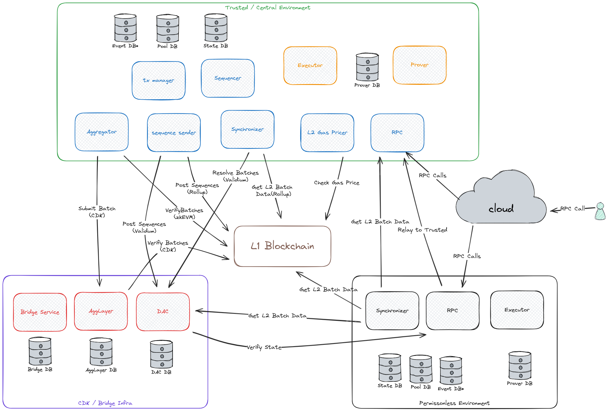

# Polygon CDK Kurtosis Package

A [Kurtosis](https://github.com/kurtosis-tech/kurtosis) package that deploys a private, portable, and modular Polygon CDK devnet.

## Getting Started



To begin, you will need to install [Docker](https://docs.docker.com/get-docker/) and [Kurtosis](https://docs.kurtosis.com/install/).

You will also need a few other tools. Run this script to check if you have the required versions:

```bash
./scripts/tool_check.sh
```

Once that is good and installed on your system, you can run the following command to deploy the complete CDK stack locally.

This process typically takes around ten minutes.

```bash
kurtosis clean --all
kurtosis run --enclave cdk-v1 --args-file params.yml --image-download always .
```

The command above deploys a CDK stack using [zkevm-node](https://github.com/0xPolygonHermez/zkevm-node) as the sequencer. Alternatively, to launch a CDK stack using [cdk-erigon](https://github.com/0xPolygonHermez/cdk-erigon) as a sequencer, you can run the following command.

```bash
kurtosis run --enclave cdk-v1 --args-file cdk-erigon-sequencer-params.yml --image-download always .
```

Let's do a simple L2 RPC test call.

First, you will need to figure out which port Kurtoiss is using for the RPC. You can get a general feel for the entire network layout by running the following command:

```bash
kurtosis enclave inspect cdk-v1
```

That output, while quite useful, might also be a little overwhelming. If you want to simply see the port mapping within the `cdk-v1` enclave for the `zkevm-node-rpc` service and the `trusted-rpc` port, you can use the following command. For this test, let's store the RPC URL in an environment variable:

```bash
export ETH_RPC_URL="$(kurtosis port print cdk-v1 zkevm-node-rpc-001 http-rpc)"
```

That is the same environment variable that `cast` uses, so you should now be able to run this command. Note that the steps below will assume you have the [Foundry toolchain](https://book.getfoundry.sh/getting-started/installation) installed.

```bash
cast block-number
```

By default, the CDK is configured in `test` mode, which means there is some pre-funded value in the admin account with address `0xE34aaF64b29273B7D567FCFc40544c014EEe9970`.

```bash
cast balance --ether 0xE34aaF64b29273B7D567FCFc40544c014EEe9970
```

Okay let’s send some transactions...

```bash
export PK="0x12d7de8621a77640c9241b2595ba78ce443d05e94090365ab3bb5e19df82c625"
cast send --legacy --private-key "$PK" --value 0.01ether 0x0000000000000000000000000000000000000000
```

Okay let’s send even more transactions... Note that this step will assume you have [polygon-cli](https://github.com/maticnetwork/polygon-cli) installed.

```bash
polycli loadtest --rpc-url "$ETH_RPC_URL" --legacy --private-key "$PK" --verbosity 700 --requests 500 --rate-limit 5 --mode t
polycli loadtest --rpc-url "$ETH_RPC_URL" --legacy --private-key "$PK" --verbosity 700 --requests 500 --rate-limit 10 --mode t
polycli loadtest --rpc-url "$ETH_RPC_URL" --legacy --private-key "$PK" --verbosity 700 --requests 500 --rate-limit 10 --mode 2
polycli loadtest --rpc-url "$ETH_RPC_URL" --legacy --private-key "$PK" --verbosity 700 --requests 500 --rate-limit 3  --mode uniswapv3
```

Pretty often, you will want to check the output from the service. Here is how you can grab some logs:

```bash
kurtosis service logs cdk-v1 zkevm-agglayer-001
```

In other cases, if you see an error, you might want to get a shell in the container to be able to poke around.

```bash
kurtosis service shell cdk-v1 zkevm-node-sequencer-001
```

One of the most common ways to check the status of the system is to make sure that batches are going through the normal progression of trusted, virtual, and verified:

```bash
cast rpc zkevm_batchNumber
cast rpc zkevm_virtualBatchNumber
cast rpc zkevm_verifiedBatchNumber
```

If the number of verified batches is increasing, then it means the system works properly.

To access the `zkevm-bridge` user interface, open this URL in your web browser.

```bash
open $(kurtosis port print cdk-v1 zkevm-bridge-proxy-001 web-ui)
```

When everything is done, you might want to clean up with this command which stops everything and deletes it.

```bash
kurtosis clean --all
```

For more information about the CDK stack and setting up Kurtosis, visit our [documentation](https://docs.polygon.technology/cdk/) on the Polygon Knowledge Layer.

## Contact

- For technical issues, join our [Discord](https://discord.gg/0xpolygonrnd).
- For documentation issues, raise an issue on the published live doc at [our main repo](https://github.com/0xPolygon/polygon-docs).

## License

Copyright (c) 2024 PT Services DMCC

Licensed under either:

- Apache License, Version 2.0, ([LICENSE-APACHE](./LICENSE-APACHE) or http://www.apache.org/licenses/LICENSE-2.0), or
- MIT license ([LICENSE-MIT](./LICENSE-MIT) or http://opensource.org/licenses/MIT)

as your option.

The SPDX license identifier for this project is `MIT` OR `Apache-2.0`.

## Contribution

Unless you explicitly state otherwise, any contribution intentionally submitted for inclusion in the work by you, as defined in the Apache-2.0 license, shall be dual licensed as above, without any additional terms or conditions.
