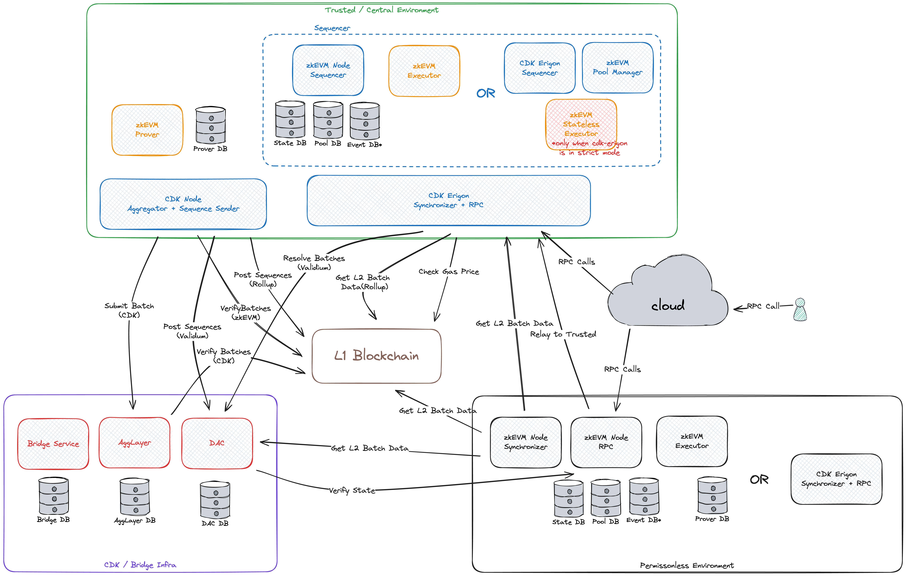
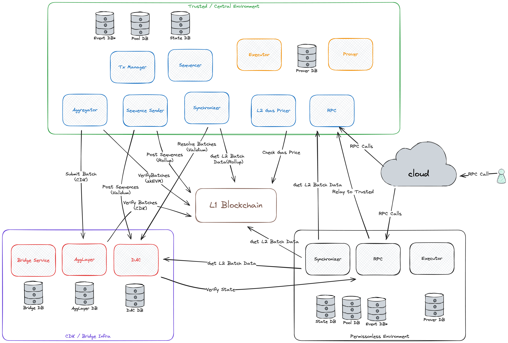

# Polygon CDK Kurtosis Package

A [Kurtosis](https://github.com/kurtosis-tech/kurtosis) package that deploys a private, portable, and modular [Polygon CDK](https://docs.polygon.technology/cdk/) devnet.

> 🚨 This package is currently designed as a **development tool** for testing configurations and scenarios within the Polygon CDK stack. **It is not recommended for long-running or production environments such as testnets or mainnet**. If you need help, you can [reach out to the Polygon team](https://polygon.technology/interest-form) or [talk to an Implementation Partner (IP)](https://ecosystem.polygon.technology/spn/cdk/).

## Table of Contents

- [Getting Started](#getting-started)
- [Additional Services](#additional-services)
- [Contact](#contact)
- [License](#license)
- [Contribution](#contribution)

## Getting Started



To begin, you will need to install [Docker](https://docs.docker.com/get-docker/) and [Kurtosis](https://docs.kurtosis.com/install/).

You will also need a few other tools. Run this script to check if you have the required versions:

```bash
./scripts/tool_check.sh
```

Once that is good and installed on your system, you can run the following command to deploy the complete CDK stack locally.

This process typically takes around ten minutes.

```bash
kurtosis clean --all
kurtosis run --enclave cdk-v1 --args-file params.yml .
```

The command above deploys the CDK stack with [cdk-erigon](https://github.com/0xPolygonHermez/cdk-erigon), serving as the sequencer. It also uses the [cdk-node](https://github.com/0xPolygon/cdk) for the remaining components.

Note that it is also possible to deploy the CDK stack using the legacy sequencer and the legacy node, referred to as the [zkevm-node](https://github.com/0xPolygonHermez/zkevm-node). In this scenario, you may need to adjust the various commands slightly; instead of targeting the `cdk-erigon-node-001` service, you should target the `zkevm-node-rpc-001`.

```bash
yq -Y --in-place '.deploy_cdk_erigon_node = false' params.yml
yq -Y --in-place '.args.sequencer_type = "zkevm"' params.yml
kurtosis run --enclave cdk-v1 --args-file params.yml .
```

<details>
<summary>Click to view the architecture diagram of the legacy CDK stack</summary>



</details>

Let's do a simple L2 RPC test call.

First, you will need to figure out which port Kurtoiss is using for the RPC. You can get a general feel for the entire network layout by running the following command:

```bash
kurtosis enclave inspect cdk-v1
```

That output, while quite useful, might also be a little overwhelming. Let's store the RPC URL in an environment variable.

```bash
export ETH_RPC_URL="$(kurtosis port print cdk-v1 cdk-erigon-node-001 http-rpc)"
```

That is the same environment variable that `cast` uses, so you should now be able to run this command. Note that the steps below will assume you have the [Foundry toolchain](https://book.getfoundry.sh/getting-started/installation) installed.

```bash
cast block-number
```

By default, the CDK is configured in `test` mode, which means there is some pre-funded value in the admin account with address `0xE34aaF64b29273B7D567FCFc40544c014EEe9970`.

```bash
cast balance --ether 0xE34aaF64b29273B7D567FCFc40544c014EEe9970
```

Okay, let’s send some transactions...

```bash
export PK="0x12d7de8621a77640c9241b2595ba78ce443d05e94090365ab3bb5e19df82c625"
cast send --legacy --private-key "$PK" --value 0.01ether 0x0000000000000000000000000000000000000000
```

Okay, let’s send even more transactions... Note that this step will assume you have [polygon-cli](https://github.com/maticnetwork/polygon-cli) installed.

```bash
polycli loadtest --rpc-url "$ETH_RPC_URL" --legacy --private-key "$PK" --verbosity 700 --requests 50000 --rate-limit 50 --mode t --concurrency 5
polycli loadtest --rpc-url "$ETH_RPC_URL" --legacy --private-key "$PK" --verbosity 700 --requests 500 --rate-limit 10 --mode 2
polycli loadtest --rpc-url "$ETH_RPC_URL" --legacy --private-key "$PK" --verbosity 700 --requests 500 --rate-limit 3  --mode uniswapv3
```

Pretty often, you will want to check the output from the service. Here is how you can grab some logs:

```bash
kurtosis service logs cdk-v1 zkevm-agglayer-001 --follow
```

In other cases, if you see an error, you might want to get a shell in the service to be able to poke around.

```bash
kurtosis service shell cdk-v1 contracts-001
jq . /opt/zkevm/combined.json
```

One of the most common ways to check the status of the system is to make sure that batches are going through the normal progression of trusted, virtual, and verified:

```bash
cast rpc zkevm_batchNumber
cast rpc zkevm_virtualBatchNumber
cast rpc zkevm_verifiedBatchNumber
```

If the number of verified batches is increasing, then it means the system works properly.

To access the `zkevm-bridge` user interface, open this URL in your web browser.

```bash
open "$(kurtosis port print cdk-v1 zkevm-bridge-proxy-001 web-ui)"
```

When everything is done, you might want to clean up with this command which stops everything and deletes it.

```bash
kurtosis clean --all
```

For more information about the CDK stack and setting up Kurtosis, visit our [documentation](https://docs.polygon.technology/cdk/) on the Polygon Knowledge Layer.

## Additional Services

A variety of additional services can be deployed alongside the CDK stack, each designed to enhance its functionality and capabilities.

Below is a list of services available for deployment using Kurtosis:

| Service | Description |
|-------- | ----------- |
| `blockscout` | Deploys the [Blockscout](https://www.blockscout.com/) stack, a comprehensive blockchain explorer for Ethereum-based networks, allowing exploration of transaction histories, account balances, and smart contract details. |
| `blutgang` | Deploys [Blutgang](https://github.com/rainshowerLabs/blutgang), an Ethereum load balancer that distributes network traffic evenly across multiple nodes to ensure high availability. |
| `pless_zkevm_node` | Deploys a permissionless [zkevm-node](https://github.com/0xPolygonHermez/zkevm-node). |
| `prometheus_grafana` | Deploys [Prometheus](https://github.com/prometheus/prometheus) and [Grafana](https://github.com/grafana/grafana), two powerful monitoring tools that collect and visualize metrics for blockchain infrastructure health and performance. Additionally, it deploys [Panoptichain](https://github.com/0xPolygon/panoptichain), enhancing monitoring capabilities by allowing users to observe on-chain data and generate detailed Polygon CDK blockchain metrics. |
| `tx_spammer` | Deploys a transaction spammer. |

Here is a simple example that deploys Blockscout, Prometheus, Grafana, and Panoptichain:

```yml
args:
  additional_services:
    - blockscout
    - prometheus_grafana
```

Once the services are deployed, you can access their web interfaces and interact with their RPCs using the following commands:

Access the different web interfaces:

- Blockscout:

```bash
open $(kurtosis port print cdk-v1 bs-frontend-001 frontend)
```

- Prometheus:

```bash
open $(kurtosis port print cdk-v1 prometheus-001 http)
```

- Grafana:

```bash
open $(kurtosis port print cdk-v1 grafana-001 dashboards)
```

Utilize the different RPC endpoints:

- Interact with Blutgang's load balancer:

```bash
cast bn --rpc-url $(kurtosis port print cdk-v1 blutgang-001 http)
```

- Connect to the permissionless zkevm-node:

```bash
cast bn --rpc-url $(kurtosis port print cdk-v1 zkevm-node-rpc-pless-001 http-rpc)
```

## Contact

- For technical issues, join our [Discord](https://discord.gg/0xpolygonrnd).
- For documentation issues, raise an issue on the published live doc at [our main repo](https://github.com/0xPolygon/polygon-docs).

## License

Copyright (c) 2024 PT Services DMCC

Licensed under either:

- Apache License, Version 2.0, ([LICENSE-APACHE](./LICENSE-APACHE) or <http://www.apache.org/licenses/LICENSE-2.0>), or
- MIT license ([LICENSE-MIT](./LICENSE-MIT) or <http://opensource.org/licenses/MIT>)

as your option.

The SPDX license identifier for this project is `MIT` OR `Apache-2.0`.

## Contribution

Unless you explicitly state otherwise, any contribution intentionally submitted for inclusion in the work by you, as defined in the Apache-2.0 license, shall be dual licensed as above, without any additional terms or conditions.
