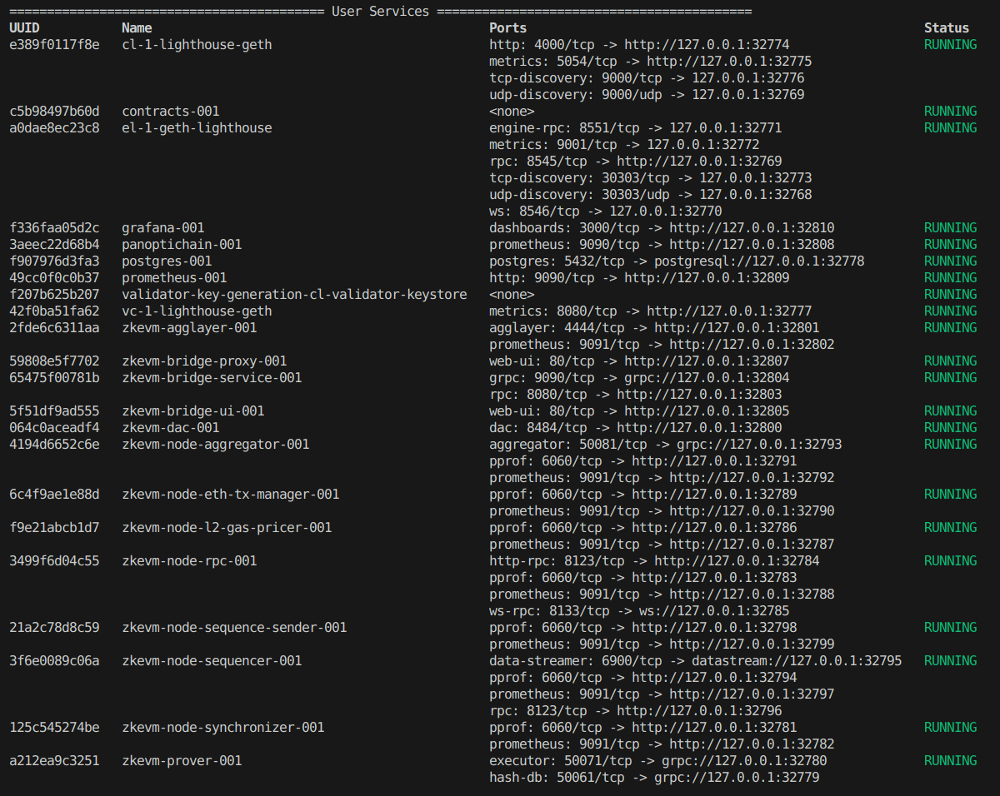
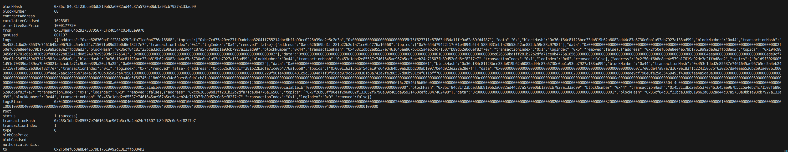
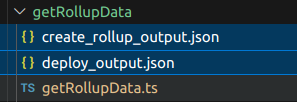
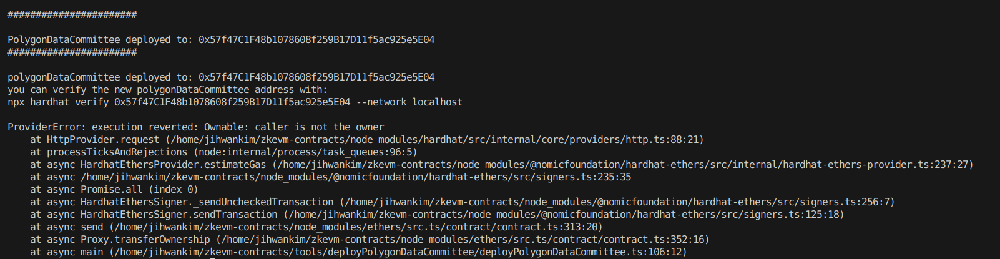
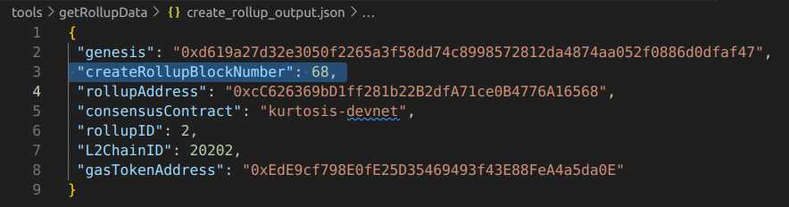
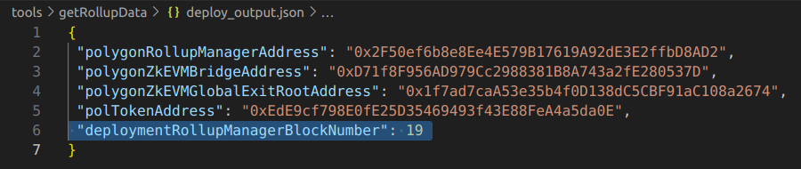
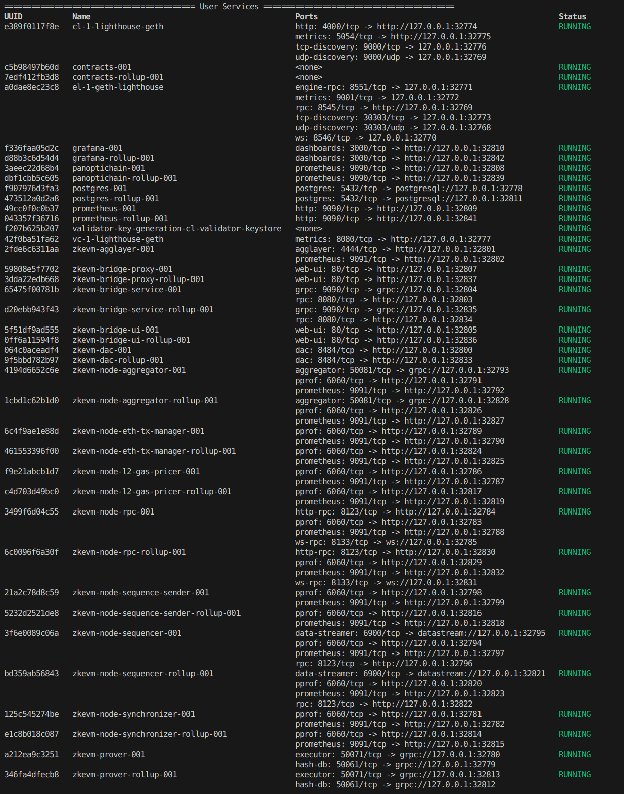
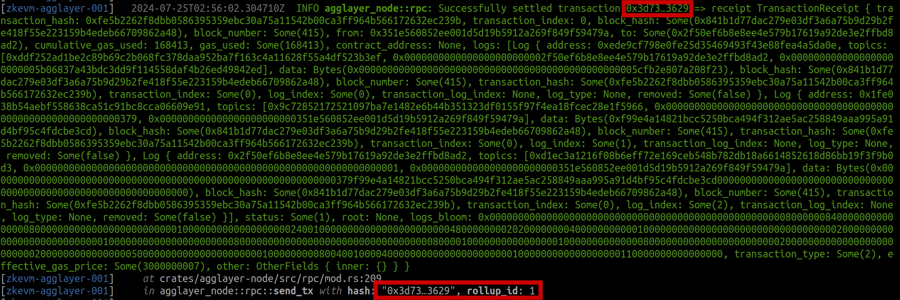

# Attaching Additional CDKs to the Agglayer with Kurtosis

1. Run the default Kurtosis CDK setup to spin up the L1 Contracts, Agglayer and CDK.
```
kurtosis run --enclave cdk-v1 github.com/0xPolygon/kurtosis-cdk --args-file params.yml --image-download always
```




2. Fund the Admin address we'll use for the second CDK.
```
rpc_url=$(kurtosis port print cdk-v1 el-1-geth-lighthouse rpc)
cast send 0x82AF8d47574BE7a8E0012FE83E7d84e4D8A1f8BA --rpc-url $rpc_url --private-key 0x12d7de8621a77640c9241b2595ba78ce443d05e94090365ab3bb5e19df82c625 --value 50ether --legacy
```
3. Create new rollup on-chain (L1) using the deployed RollupManager Contract. Adjust the below values as necessary - it must be **exactly** corrrect to work.
```
deployer_address="0xE34aaF64b29273B7D567FCFc40544c014EEe9970"
rpc_url=$(kurtosis port print cdk-v1 el-1-geth-lighthouse rpc)
rollup_manager_address="0x2F50ef6b8e8Ee4E579B17619A92dE3E2ffbD8AD2"
gasTokenAddress="0xEdE9cf798E0fE25D35469493f43E88FeA4a5da0E"
rollupTypeID="1"
chainID="20202"
admin="0x82AF8d47574BE7a8E0012FE83E7d84e4D8A1f8BA"
sequencer="0xF4ee37aAc3ccd6B71A4a795700b065d2CA479581"
sequencerURL=""
networkName="Kurtosis CDK"
tx_input=$(cast calldata 'createNewRollup(uint32,uint64,address,address,address,string,string)' "$rollupTypeID" "$chainID" "$admin" "$sequencer" "$gasTokenAddress"  "$sequencerURL" "$networkName")
cast send --private-key 0x12d7de8621a77640c9241b2595ba78ce443d05e94090365ab3bb5e19df82c625 --rpc-url $rpc_url $rollup_manager_address $tx_input --legacy
```
Note the `sequencerURL` is empty, because this value is unknown until the second CDK is deployed. This can be changed later by invoking the smart contract after deployment.



4. Clone the zkEVM Contracts [repo](https://github.com/0xPolygonHermez/zkevm-contracts). The tools included in the repo will be used.
```
git clone https://github.com/0xPolygonHermez/zkevm-contracts
```

5. Change [hardhat.config.ts](https://github.com/0xPolygonHermez/zkevm-contracts/blob/main/hardhat.config.ts) contents.

```
        localhost: {
            url: <el-1-geth-lighthouse rpc>,
            chainId: 271828,
            accounts: {
                mnemonic: process.env.MNEMONIC || DEFAULT_MNEMONIC,
                path: "m/44'/60'/0'/0",
                initialIndex: 0,
                count: 20,
            },
        },
```

6. Comment out the below `//` lines in `getRollupData.ts`
```
    // const upgradeToULxLyBlockNumber = eventsAddRollup[0].blockNumber;
    const deployOutput = {
        polygonRollupManagerAddress: rollupManager.target,
        polygonZkEVMBridgeAddress,
        polygonZkEVMGlobalExitRootAddress,
        polTokenAddress,
        deploymentRollupManagerBlockNumber,
        // upgradeToULxLyBlockNumber,
    };
```

7. Change the contents of `rollupDataParams.json`
```
{
    "polygonRollupManagerAddress": "0x2F50ef6b8e8Ee4E579B17619A92dE3E2ffbD8AD2",
    "rollupID": 2
}
```

8. Run the below command to get rollup data.
```
npx hardhat run --network localhost tools/getRollupData/getRollupData.ts
```
Check that `create_rollup_ouput.json` and `deploy_output.json` are created.



9. Change the contents of `deploy_dataCommittee_parameters.json`
```
{
    "admin": "0x82AF8d47574BE7a8E0012FE83E7d84e4D8A1f8BA", #Second CDK Admin Address
    "deployerPvtKey": "0x12d7de8621a77640c9241b2595ba78ce443d05e94090365ab3bb5e19df82c625", #First CDK Admin Adress Pvt Key
    "maxFeePerGas": "",
    "maxPriorityFeePerGas": "",
    "multiplierGas": ""
}
```

10. Run the below command to deploy the DAC. 
```
npx hardhat run --network localhost tools/deployPolygonDataCommittee/deployPolygonDataCommittee.ts
```



11. Transfer the ownership of DAC to the Second CDK admin. The first `cast call` should return the address of the First CDK admin, and after `cast send` this should be changed to the Second CDK admin.
```
dacAddress="0x57f47C1F48b1078608f259B17D11f5ac925e5E04"
cast call --rpc-url $(kurtosis port print cdk-v1 el-1-geth-lighthouse rpc) $dacAddress 'owner()(address)'
cast send --private-key 0x12d7de8621a77640c9241b2595ba78ce443d05e94090365ab3bb5e19df82c625 --rpc-url $(kurtosis port print cdk-v1 el-1-geth-lighthouse rpc) $dacAddress 'transferOwnership(address)' 0x82AF8d47574BE7a8E0012FE83E7d84e4D8A1f8BA
```

12. Activate the DAC. Not `rollupAddress` is the output which can be found in `create_rollup_output.json`. The first `cast call` should return `0x0000000000000000000000000000000000000000000000000000000000000000`, because there is no DAC activated. After running `cast send` this should be changed to the deployed DAC address.
```
rollupAddress="0xcC626369bD1ff281b22B2dfA71ce0B4776A16568"
secondCDKAdminPvtKey="e615cece38a4f6f91a153c2f75c11201ef5bbc7f337dd7d319df37eeb63f557f"
cast call --rpc-url $(kurtosis port print cdk-v1 el-1-geth-lighthouse rpc) $rollupAddress 'dataAvailabilityProtocol()'
cast send --private-key $secondCDKAdminPvtKey --rpc-url $(kurtosis port print cdk-v1 el-1-geth-lighthouse rpc) $rollupAddress 'setDataAvailabilityProtocol(address)' $dacAddress
```

13. Create a new branch of [Kurtosis-CDK](https://github.com/0xPolygon/kurtosis-cdk) and apply the below patch to spin up the Second CDK using `git am < <file_name>.patch`

<details>
<summary>0001-squash.patch</summary>
    
From 09c17c2bed526229445f38616c24165a95678b4c Mon Sep 17 00:00:00 2001
From: Ji Hwan <jkim@polygon.technology>
Date: Mon, 22 Jul 2024 15:08:52 +0900
Subject: [PATCH] squash

---
 cdk-erigon-sequencer-params.yml               |  2 +-
 cdk_bridge_infra.star                         | 94 ++++++++++---------
 input_parser.star                             |  2 +-
 kurtosis.yml                                  |  2 +-
 params.yml                                    | 50 +++++-----
 templates/bridge-infra/agglayer-config.toml   |  2 +-
 templates/bridge-infra/bridge-config.toml     |  2 +-
 templates/bridge-infra/haproxy.cfg            | 10 +-
 .../create_rollup_parameters.json             |  1 -
 .../contract-deploy/run-contract-setup.sh     | 22 ++---
 templates/trusted-node/dac-config.toml        |  2 +-
 templates/trusted-node/node-config.toml       |  6 +-
 12 files changed, 99 insertions(+), 96 deletions(-)

diff --git a/cdk-erigon-sequencer-params.yml b/cdk-erigon-sequencer-params.yml
index 1c16550..32807ca 100644
--- a/cdk-erigon-sequencer-params.yml
+++ b/cdk-erigon-sequencer-params.yml
@@ -137,7 +137,7 @@ args:
   ## Rollup configuration.
 
   # The chain id of the new rollup.
-  zkevm_rollup_chain_id: 10101
+  zkevm_rollup_chain_id: 20202
 
   # The fork id of the new rollup. It indicates the prover (zkROM/executor) version.
   zkevm_rollup_fork_id: 9
diff --git a/cdk_bridge_infra.star b/cdk_bridge_infra.star
index 92b2ad7..b31e135 100644
--- a/cdk_bridge_infra.star
+++ b/cdk_bridge_infra.star
@@ -1,5 +1,5 @@
 service_package = import_module("./lib/service.star")
-zkevm_agglayer_package = import_module("./lib/zkevm_agglayer.star")
+# zkevm_agglayer_package = import_module("./lib/zkevm_agglayer.star")
 zkevm_bridge_package = import_module("./lib/zkevm_bridge.star")
 databases = import_module("./databases.star")
 
@@ -22,21 +22,25 @@ def run(plan, args):
     )
 
     # Create the agglayer service config.
-    agglayer_config_artifact = create_agglayer_config_artifact(
-        plan, args, contract_setup_addresses, db_configs
-    )
-    agglayer_keystore_artifact = plan.store_service_files(
-        name="agglayer-keystore",
-        service_name="contracts" + args["deployment_suffix"],
-        src="/opt/zkevm/agglayer.keystore",
-    )
-    agglayer_config = zkevm_agglayer_package.create_agglayer_service_config(
-        args, agglayer_config_artifact, agglayer_keystore_artifact
-    )
+    # agglayer_config_artifact = create_agglayer_config_artifact(
+    #     plan, args, contract_setup_addresses, db_configs
+    # )
+    # agglayer_keystore_artifact = plan.store_service_files(
+    #     name="agglayer-keystore",
+    #     service_name="contracts" + args["deployment_suffix"],
+    #     src="/opt/zkevm/agglayer.keystore",
+    # )
+    # agglayer_config = zkevm_agglayer_package.create_agglayer_service_config(
+    #     args, agglayer_config_artifact, agglayer_keystore_artifact
+    # )
 
     # Start the bridge service and the agglayer.
+    # bridge_infra_services = plan.add_services(
+    #     configs=bridge_config | agglayer_config,
+    #     description="Starting bridge infra",
+    # )
     bridge_infra_services = plan.add_services(
-        configs=bridge_config | agglayer_config,
+        configs=bridge_config,
         description="Starting bridge infra",
     )
 
@@ -51,35 +55,35 @@ def run(plan, args):
     zkevm_bridge_package.start_reverse_proxy(plan, args, proxy_config_artifact)
 
 
-def create_agglayer_config_artifact(plan, args, contract_setup_addresses, db_configs):
-    agglayer_config_template = read_file(
-        src="./templates/bridge-infra/agglayer-config.toml"
-    )
-    return plan.render_templates(
-        name="agglayer-config-artifact",
-        config={
-            "agglayer-config.toml": struct(
-                template=agglayer_config_template,
-                # TODO: Organize those args.
-                data={
-                    "deployment_suffix": args["deployment_suffix"],
-                    "l1_chain_id": args["l1_chain_id"],
-                    "l1_rpc_url": args["l1_rpc_url"],
-                    "zkevm_l2_keystore_password": args["zkevm_l2_keystore_password"],
-                    "zkevm_l2_proofsigner_address": args[
-                        "zkevm_l2_proofsigner_address"
-                    ],
-                    # ports
-                    "zkevm_rpc_http_port": args["zkevm_rpc_http_port"],
-                    "zkevm_agglayer_port": args["zkevm_agglayer_port"],
-                    "zkevm_prometheus_port": args["zkevm_prometheus_port"],
-                    "l2_rpc_name": args["l2_rpc_name"],
-                }
-                | contract_setup_addresses
-                | db_configs,
-            )
-        },
-    )
+# def create_agglayer_config_artifact(plan, args, contract_setup_addresses, db_configs):
+#     agglayer_config_template = read_file(
+#         src="./templates/bridge-infra/agglayer-config.toml"
+#     )
+#     return plan.render_templates(
+#         name="agglayer-config-artifact",
+#         config={
+#             "agglayer-config.toml": struct(
+#                 template=agglayer_config_template,
+#                 # TODO: Organize those args.
+#                 data={
+#                     "deployment_suffix": args["deployment_suffix"],
+#                     "l1_chain_id": args["l1_chain_id"],
+#                     "l1_rpc_url": args["l1_rpc_url"],
+#                     "zkevm_l2_keystore_password": args["zkevm_l2_keystore_password"],
+#                     "zkevm_l2_proofsigner_address": args[
+#                         "zkevm_l2_proofsigner_address"
+#                     ],
+#                     # ports
+#                     "zkevm_rpc_http_port": args["zkevm_rpc_http_port"],
+#                     "zkevm_agglayer_port": args["zkevm_agglayer_port"],
+#                     "zkevm_prometheus_port": args["zkevm_prometheus_port"],
+#                     "l2_rpc_name": args["l2_rpc_name"],
+#                 }
+#                 | contract_setup_addresses
+#                 | db_configs,
+#             )
+#         },
+#     )
 
 
 def create_bridge_config_artifact(plan, args, contract_setup_addresses, db_configs):
@@ -130,7 +134,7 @@ def create_reverse_proxy_config_artifact(plan, args):
         src="./templates/bridge-infra/haproxy.cfg"
     )
 
-    l1rpc_service = plan.get_service("el-1-geth-lighthouse")
+    # l1rpc_service = plan.get_service("el-1-geth-lighthouse")
     l2rpc_service = plan.get_service(
         name=args["l2_rpc_name"] + args["deployment_suffix"]
     )
@@ -147,8 +151,8 @@ def create_reverse_proxy_config_artifact(plan, args):
             "haproxy.cfg": struct(
                 template=bridge_ui_proxy_config_template,
                 data={
-                    "l1rpc_ip": l1rpc_service.ip_address,
-                    "l1rpc_port": l1rpc_service.ports["rpc"].number,
+                    # "l1rpc_ip": l1rpc_service.ip_address,
+                    # "l1rpc_port": l1rpc_service.ports["rpc"].number,
                     "l2rpc_ip": l2rpc_service.ip_address,
                     "l2rpc_port": l2rpc_service.ports["http-rpc"].number,
                     "bridgeservice_ip": bridge_service.ip_address,
diff --git a/input_parser.star b/input_parser.star
index 2bd12c3..3b39542 100644
--- a/input_parser.star
+++ b/input_parser.star
@@ -56,7 +56,7 @@ DEFAULT_ARGS = {
     "l1_additional_services": [],
     "l1_preset": "mainnet",
     "l1_seconds_per_slot": 12,
-    "zkevm_rollup_chain_id": 10101,
+    "zkevm_rollup_chain_id": 20202,
     "zkevm_rollup_fork_id": 9,
     "polygon_zkevm_explorer": "https://explorer.private/",
     "l1_explorer_url": "https://sepolia.etherscan.io/",
diff --git a/kurtosis.yml b/kurtosis.yml
index 97159d3..9133aaa 100644
--- a/kurtosis.yml
+++ b/kurtosis.yml
@@ -127,7 +127,7 @@ description: |-
   ## Rollup configuration.
 
   # The chain id of the new rollup.
-  zkevm_rollup_chain_id: 10101
+  zkevm_rollup_chain_id: 20202
 
   # The fork id of the new rollup. It indicates the prover (zkROM/executor) version.
   zkevm_rollup_fork_id: 9
diff --git a/params.yml b/params.yml
index 836f5f9..1966158 100644
--- a/params.yml
+++ b/params.yml
@@ -3,7 +3,7 @@
 # The deployment process is divided into various stages.
 
 # Deploy local L1.
-deploy_l1: true
+deploy_l1: false
 
 # Deploy zkevm contracts on L1 (and also fund accounts).
 deploy_zkevm_contracts_on_l1: true
@@ -35,7 +35,7 @@ apply_workload: false
 args:
   # Suffix appended to service names.
   # Note: It should be a string.
-  deployment_suffix: "-001"
+  deployment_suffix: "-rollup-001"
 
   # The type of data availability to use.
   # Options:
@@ -87,32 +87,32 @@ args:
   # Addresses and private keys of the different components.
   # They have been generated using the following command:
   # polycli wallet inspect --mnemonic 'lab code glass agree maid neutral vessel horror deny frequent favorite soft gate galaxy proof vintage once figure diary virtual scissors marble shrug drop' --addresses 9 | tee keys.txt | jq -r '.Addresses[] | [.ETHAddress, .HexPrivateKey] | @tsv' | awk 'BEGIN{split("sequencer,aggregator,claimtxmanager,timelock,admin,loadtest,agglayer,dac,proofsigner",roles,",")} {print "zkevm_l2_" roles[NR] "_address: \"" $1 "\""; print "zkevm_l2_" roles[NR] "_private_key: \"0x" $2 "\"\n"}'
-  zkevm_l2_sequencer_address: "0x5b06837A43bdC3dD9F114558DAf4B26ed49842Ed"
-  zkevm_l2_sequencer_private_key: "0x183c492d0ba156041a7f31a1b188958a7a22eebadca741a7fe64436092dc3181"
+  zkevm_l2_sequencer_address: "0xF4ee37aAc3ccd6B71A4a795700b065d2CA479581"
+  zkevm_l2_sequencer_private_key: "39fa0e0993fdde70f16434fe5085cc7992bb82aa8acc765acc9f8c79d7751350"
 
-  zkevm_l2_aggregator_address: "0xCae5b68Ff783594bDe1b93cdE627c741722c4D4d"
-  zkevm_l2_aggregator_private_key: "0x2857ca0e7748448f3a50469f7ffe55cde7299d5696aedd72cfe18a06fb856970"
+  zkevm_l2_aggregator_address: "0x78DE6D4fD4848d7A79cBB5117FED025e2d482bED"
+  zkevm_l2_aggregator_private_key: "a624aee34e44e828a03bd8ecbeca5807d9187351e6772995b82c15f5610a4cf2"
 
-  zkevm_l2_claimtxmanager_address: "0x5f5dB0D4D58310F53713eF4Df80ba6717868A9f8"
-  zkevm_l2_claimtxmanager_private_key: "0x8d5c9ecd4ba2a195db3777c8412f8e3370ae9adffac222a54a84e116c7f8b934"
+  zkevm_l2_claimtxmanager_address: "0xf909b5F902D19CACB8B06c037bEf0a5345E99331"
+  zkevm_l2_claimtxmanager_private_key: "410affbfff4ba53a8784d3c71f983feeb410d3be0e4f7fec4dba1612bbcc4acf"
 
-  zkevm_l2_timelock_address: "0x130aA39Aa80407BD251c3d274d161ca302c52B7A"
-  zkevm_l2_timelock_private_key: "0x80051baf5a0a749296b9dcdb4a38a264d2eea6d43edcf012d20b5560708cf45f"
+  zkevm_l2_timelock_address: "0x901b68102f6C695D62692499EB92e2B02E69A106"
+  zkevm_l2_timelock_private_key: "58397f0a1789f1d97cb9d9eb986fb05831d18b410b496d7baf66bac9baa7c952"
 
-  zkevm_l2_admin_address: "0xE34aaF64b29273B7D567FCFc40544c014EEe9970"
-  zkevm_l2_admin_private_key: "0x12d7de8621a77640c9241b2595ba78ce443d05e94090365ab3bb5e19df82c625"
+  zkevm_l2_admin_address: "0x82AF8d47574BE7a8E0012FE83E7d84e4D8A1f8BA"
+  zkevm_l2_admin_private_key: "e615cece38a4f6f91a153c2f75c11201ef5bbc7f337dd7d319df37eeb63f557f"
 
-  zkevm_l2_loadtest_address: "0x81457240ff5b49CaF176885ED07e3E7BFbE9Fb81"
-  zkevm_l2_loadtest_private_key: "0xd7df6d64c569ffdfe7c56e6b34e7a2bdc7b7583db74512a9ffe26fe07faaa5de"
+  zkevm_l2_loadtest_address: "0x2d1bd6e35fD386066fDebbf54eb75B436DFa93b4"
+  zkevm_l2_loadtest_private_key: "c63cd87974fc7742a5f92df58e365517e4ef134864cd8b1d600d1fdf3d3d5049"
 
-  zkevm_l2_agglayer_address: "0x351e560852ee001d5D19b5912a269F849f59479a"
-  zkevm_l2_agglayer_private_key: "0x1d45f90c0a9814d8b8af968fa0677dab2a8ff0266f33b136e560fe420858a419"
+  zkevm_l2_agglayer_address: "0x1Bf81F72A112B7b485db45f523ED93734C2630ff"
+  zkevm_l2_agglayer_private_key: "1455c65719e11c70183234ae0e840a39bad98c8c65109721871bbb605fd13754"
 
-  zkevm_l2_dac_address: "0x5951F5b2604c9B42E478d5e2B2437F44073eF9A6"
-  zkevm_l2_dac_private_key: "0x85d836ee6ea6f48bae27b31535e6fc2eefe056f2276b9353aafb294277d8159b"
+  zkevm_l2_dac_address: "0xfA2542aca48930aae82C9291f1F029a189C6921b"
+  zkevm_l2_dac_private_key: "3d7ca1abd8651954b6d060e06c2d2cee72cb95252f2ec48c0034c3fb078eecf1"
 
-  zkevm_l2_proofsigner_address: "0x7569cc70950726784c8D3bB256F48e43259Cb445"
-  zkevm_l2_proofsigner_private_key: "0x77254a70a02223acebf84b6ed8afddff9d3203e31ad219b2bf900f4780cf9b51"
+  zkevm_l2_proofsigner_address: "0x101026E7dADbDd880Bef32884eb63A414C939bb6"
+  zkevm_l2_proofsigner_private_key: "f46b741e1571a2186b7f4f0a9c6dc25697b36eabbe7ea03da3a3f1b2d060b56c"
 
   # Keystore password.
   zkevm_l2_keystore_password: pSnv6Dh5s9ahuzGzH9RoCDrKAMddaX3m
@@ -135,20 +135,20 @@ args:
   ## Rollup configuration.
 
   # The chain id of the new rollup.
-  zkevm_rollup_chain_id: 10101
+  zkevm_rollup_chain_id: 20202
 
   # The fork id of the new rollup. It indicates the prover (zkROM/executor) version.
   zkevm_rollup_fork_id: 9
 
   # The address of the rollup manager contract on L1.
   # If specified, the rollup data will be retrieved from this contract instead of using the contracts service.
-  # zkevm_rollup_manager_address: ""
+  # zkevm_rollup_manager_address: "0x2F50ef6b8e8Ee4E579B17619A92dE3E2ffbD8AD2"
   # # The block number at which the rollup manager contract was deployed.
-  # zkevm_rollup_manager_block_number: 0
+  # zkevm_rollup_manager_block_number: 19
   # # The address of the global exit root contract on L2.
-  # zkevm_global_exit_root_l2_address: ""
+  # zkevm_global_exit_root_l2_address: "0xa40d5f56745a118d0906a34e69aec8c0db1cb8fa"
   # # The address of the Polygon data committee contract on L1.
-  # polygon_data_committee_address: ""
+  # polygon_data_committee_address: "0x5A6896A98c4B7C7E8f16d177C719a1d856b9154c"
 
   polygon_zkevm_explorer: https://explorer.private/
   l1_explorer_url: https://sepolia.etherscan.io/
diff --git a/templates/bridge-infra/agglayer-config.toml b/templates/bridge-infra/agglayer-config.toml
index e43de3a..8bc5cb3 100644
--- a/templates/bridge-infra/agglayer-config.toml
+++ b/templates/bridge-infra/agglayer-config.toml
@@ -14,7 +14,7 @@ MaxRequestsPerIPAndSecond = 5000
 
 [Log]
 Environment = "production" # "production" or "development"
-Level = "info"
+Level = "debug"
 Outputs = ["stderr"]
 
 [DB]
diff --git a/templates/bridge-infra/bridge-config.toml b/templates/bridge-infra/bridge-config.toml
index e3b04c4..e9914ab 100644
--- a/templates/bridge-infra/bridge-config.toml
+++ b/templates/bridge-infra/bridge-config.toml
@@ -1,5 +1,5 @@
 [Log]
-Level = "info"
+Level = "debug"
 Environment = "production"
 Outputs = ["stderr"]
 
diff --git a/templates/bridge-infra/haproxy.cfg b/templates/bridge-infra/haproxy.cfg
index 093d36d..4450c0c 100644
--- a/templates/bridge-infra/haproxy.cfg
+++ b/templates/bridge-infra/haproxy.cfg
@@ -21,20 +21,20 @@ frontend http_in
     http-response set-header Access-Control-Allow-Methods "GET, DELETE, OPTIONS, POST, PUT"
 
     # Define ACLs for URL matching
-    acl url_l1rpc path_beg /l1rpc
+    # acl url_l1rpc path_beg /l1rpc
     acl url_l2rpc path_beg /l2rpc
     acl url_bridgeservice path_beg /bridgeservice
 
     # Use backend based on ACL match
-    use_backend backend_l1rpc if url_l1rpc
+    # use_backend backend_l1rpc if url_l1rpc
     use_backend backend_l2rpc if url_l2rpc
     use_backend backend_bridgeservice if url_bridgeservice
     default_backend backend_default
 
 # Backend configuration for /l1rpc
-backend backend_l1rpc
-    http-request set-path /
-    server server1 {{.l1rpc_ip}}:{{.l1rpc_port}}
+# backend backend_l1rpc
+#     http-request set-path /
+#     server server1 {{.l1rpc_ip}}:{{.l1rpc_port}}
 
 # Backend configuration for /l2rpc
 backend backend_l2rpc
diff --git a/templates/contract-deploy/create_rollup_parameters.json b/templates/contract-deploy/create_rollup_parameters.json
index 25778b7..e48dc40 100644
--- a/templates/contract-deploy/create_rollup_parameters.json
+++ b/templates/contract-deploy/create_rollup_parameters.json
@@ -4,7 +4,6 @@
     "consensusContract": "{{.zkevm_rollup_consensus}}",
     "dataAvailabilityProtocol": "PolygonDataCommittee",
     "deployerPvtKey": "{{.zkevm_l2_admin_private_key}}",
-    "description": "kurtosis-devnet",
     "forkID": {{.zkevm_rollup_fork_id}},
     "gasTokenAddress":"",
     "maxFeePerGas": "",
diff --git a/templates/contract-deploy/run-contract-setup.sh b/templates/contract-deploy/run-contract-setup.sh
index 281a502..bc760b4 100755
--- a/templates/contract-deploy/run-contract-setup.sh
+++ b/templates/contract-deploy/run-contract-setup.sh
@@ -34,10 +34,10 @@ fund_account_on_l1() {
 
 # We want to avoid running this script twice.
 # In the future it might make more sense to exit with an error code.
-if [[ -e "/opt/zkevm/.init-complete.lock" ]]; then
-    echo "This script has already been executed"
-    exit
-fi
+# if [[ -e "/opt/zkevm/.init-complete.lock" ]]; then
+#     echo "This script has already been executed"
+#     exit
+# fi
 
 # Wait for the L1 RPC to be available.
 echo_ts "Waiting for the L1 RPC to be available"
@@ -128,14 +128,14 @@ if [[ fork_id -lt 8 ]]; then
 fi
 
 # NOTE there is a disconnect in the necessary configurations here between the validium node and the zkevm node
-jq --slurpfile c combined.json '.rollupCreationBlockNumber = $c[0].createRollupBlockNumber' genesis.json > g.json; mv g.json genesis.json
-jq --slurpfile c combined.json '.rollupManagerCreationBlockNumber = $c[0].upgradeToULxLyBlockNumber' genesis.json > g.json; mv g.json genesis.json
-jq --slurpfile c combined.json '.genesisBlockNumber = $c[0].createRollupBlockNumber' genesis.json > g.json; mv g.json genesis.json
+jq --slurpfile c combined.json '.rollupCreationBlockNumber = 68' genesis.json > g.json; mv g.json genesis.json
+jq --slurpfile c combined.json '.rollupManagerCreationBlockNumber = 19' genesis.json > g.json; mv g.json genesis.json
+jq --slurpfile c combined.json '.genesisBlockNumber = 68' genesis.json > g.json; mv g.json genesis.json
 jq --slurpfile c combined.json '.L1Config = {chainId:{{.l1_chain_id}}}' genesis.json > g.json; mv g.json genesis.json
-jq --slurpfile c combined.json '.L1Config.polygonZkEVMGlobalExitRootAddress = $c[0].polygonZkEVMGlobalExitRootAddress' genesis.json > g.json; mv g.json genesis.json
-jq --slurpfile c combined.json '.L1Config.polygonRollupManagerAddress = $c[0].polygonRollupManagerAddress' genesis.json > g.json; mv g.json genesis.json
-jq --slurpfile c combined.json '.L1Config.polTokenAddress = $c[0].polTokenAddress' genesis.json > g.json; mv g.json genesis.json
-jq --slurpfile c combined.json '.L1Config.polygonZkEVMAddress = $c[0].rollupAddress' genesis.json > g.json; mv g.json genesis.json
+jq --slurpfile c combined.json '.L1Config.polygonZkEVMGlobalExitRootAddress = "0x1f7ad7caA53e35b4f0D138dC5CBF91aC108a2674"' genesis.json > g.json; mv g.json genesis.json
+jq --slurpfile c combined.json '.L1Config.polygonRollupManagerAddress = "0x2F50ef6b8e8Ee4E579B17619A92dE3E2ffbD8AD2"' genesis.json > g.json; mv g.json genesis.json
+jq --slurpfile c combined.json '.L1Config.polTokenAddress = "0xEdE9cf798E0fE25D35469493f43E88FeA4a5da0E"' genesis.json > g.json; mv g.json genesis.json
+jq --slurpfile c combined.json '.L1Config.polygonZkEVMAddress = "0xcC626369bD1ff281b22B2dfA71ce0B4776A16568"' genesis.json > g.json; mv g.json genesis.json
 
 # Create cdk-erigon node configs
 jq_script='
diff --git a/templates/trusted-node/dac-config.toml b/templates/trusted-node/dac-config.toml
index f692834..793bf80 100644
--- a/templates/trusted-node/dac-config.toml
+++ b/templates/trusted-node/dac-config.toml
@@ -13,7 +13,7 @@ TrackSequencer = false
 
 [Log]
 Environment = "development" # "production" or "development"
-Level = "info"
+Level = "debug"
 Outputs = ["stderr"]
 
 [DB]
diff --git a/templates/trusted-node/node-config.toml b/templates/trusted-node/node-config.toml
index a4f0db6..4e1d64f 100644
--- a/templates/trusted-node/node-config.toml
+++ b/templates/trusted-node/node-config.toml
@@ -68,7 +68,7 @@ Environment = "production"
 # log. Generally we'll switch to debug if we want to troubleshoot
 # something specifically otherwise we leave it at info
 # ------------------------------------------------------------------------------
-Level = "info"
+Level = "debug"
 
 # ------------------------------------------------------------------------------
 # Outputs define the output paths for writing logs. The default is to
@@ -1027,7 +1027,7 @@ Environment = "production"
 # log. Generally we'll switch to debug if we want to troubleshoot
 # something specifically otherwise we leave it at info
 # ------------------------------------------------------------------------------
-Level = "info"
+Level = "debug"
 
 # ==============================================================================
 #  ____  _____ ___  _   _ _____ _   _  ____ _____ ____  _____ _   _ ____  _____ ____
@@ -1263,7 +1263,7 @@ AggLayerTxTimeout = "600s"
 # ------------------------------------------------------------------------------
 # AggLayerURL is the RPC URL of the agglayer itself
 # ------------------------------------------------------------------------------
-AggLayerURL = "http://zkevm-agglayer{{.deployment_suffix}}:{{.zkevm_agglayer_port}}"
+AggLayerURL = "http://zkevm-agglayer-001:{{.zkevm_agglayer_port}}"
 {{else}}
 
 # ------------------------------------------------------------------------------
-- 
2.34.1

</details>

After applying the patch, edit the below contents within [run-contract-setup.sh](https://github.com/0xPolygon/kurtosis-cdk/blob/main/templates/contract-deploy/run-contract-setup.sh)

The values can be found from the previous `getRollupData` ouputs.





```
jq --slurpfile c combined.json '.rollupCreationBlockNumber = <create_rollup_output.createRollupBlockNumber>' genesis.json > g.json; mv g.json genesis.json
jq --slurpfile c combined.json '.rollupManagerCreationBlockNumber = <deploy_output.deploymentRollupManagerBlockNumber>' genesis.json > g.json; mv g.json genesis.json
jq --slurpfile c combined.json '.genesisBlockNumber = <create_rollup_output.createRollupBlockNumber>' genesis.json > g.json; mv g.json genesis.json
jq --slurpfile c combined.json '.L1Config = {chainId:{{.l1_chain_id}}}' genesis.json > g.json; mv g.json genesis.json
jq --slurpfile c combined.json '.L1Config.polygonZkEVMGlobalExitRootAddress = "<deploy_output.polygonZkEVMGlobalExitRootAddress>"' genesis.json > g.json; mv g.json genesis.json
jq --slurpfile c combined.json '.L1Config.polygonRollupManagerAddress = "<deploy_output.polygonRollupManagerAddress>"' genesis.json > g.json; mv g.json genesis.json
jq --slurpfile c combined.json '.L1Config.polTokenAddress = "<deploy_output.polTokenAddress>"' genesis.json > g.json; mv g.json genesis.json
jq --slurpfile c combined.json '.L1Config.polygonZkEVMAddress = "<create_rollup_output.rollupAddress>"' genesis.json > g.json; mv g.json genesis.json
``` 
    
14. Run the patched Kurtosis-CDK.
```
kurtosis run --enclave cdk-v1 --args-file params.yml --image-download always .
```



15. Change sequencerURL onchain. The first `cast call` should return `""` because this is how we set it above. Now that the Second CDK's Sequencer is deployed, change it using `cast send`.
```
rollupAddress="0xcC626369bD1ff281b22B2dfA71ce0B4776A16568"
secondCDKAdminPvtKey="e615cece38a4f6f91a153c2f75c11201ef5bbc7f337dd7d319df37eeb63f557f"
cast call --rpc-url $(kurtosis port print cdk-v1 el-1-geth-lighthouse rpc) $rollupAddress 'trustedSequencerURL()(string)'
cast send --private-key $secondCDKAdminPvtKey --rpc-url $(kurtosis port print cdk-v1 el-1-geth-lighthouse rpc) $rollupAddress 'setTrustedSequencerURL(string)' $(kurtosis port print cdk-v1 zkevm-node-sequencer-rollup-001 rpc) 
```
    
16. Change the `agglayer-config.toml` to correctly map the `RollupID` with the signer keys and RPCs.
```
# Shell into the Agglayer service
kurtosis service shell cdk-v1 zkevm-agglayer-001

# Change directory
cd /etc/zkevm

# Install Vim
apt update && apt install vim -y
    
# Edit the contents of agglayer-config.toml
vim agglayer-config.toml
    
# Edit below sections
[FullNodeRPCs]
# First CDK RPC
1 = "http://zkevm-node-rpc-001:8123"
# Second CDK RPC
2 = "http://zkevm-node-rpc-rollup-001:8123"

[ProofSigners]
# First CDK Sequencer Address
1 = "0x5b06837A43bdC3dD9F114558DAf4B26ed49842Ed" 
# Second CDK Sequencer Address
2 = "0xF4ee37aAc3ccd6B71A4a795700b065d2CA479581" 
```    

Agglayer settling signed transactions from `rollup_id: 1`



Agglayer settling signed transactions from `rollup_id: 2`


