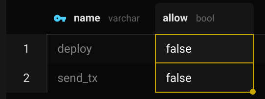
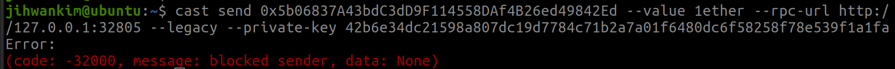
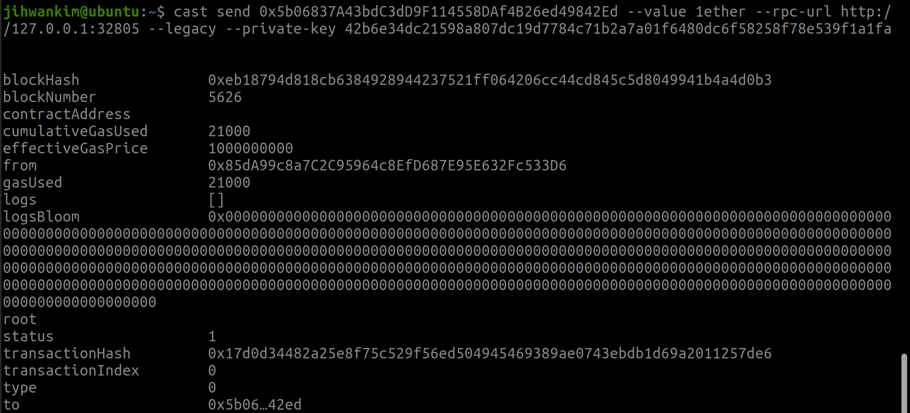
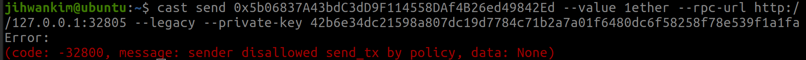

# Policies in CDK
* Allowlists
* Denylists
* AccessControlLists

[Policies](https://docs.polygon.technology/cdk/how-to/manage-policies/#get-information-about-a-policy) in CDK is used for network level access control, and can block specific addresses from entering the pool completely. The use case in Kurtosis may require direct writes to the DB as documented in this guide.

## Note
* Policies have been tested only in cases when `send_tx` and `deploy` policies are only set to `false`. 

## Blocking addresses
By default, the two available policies:
* send_tx
    * Allows sending txns within the network
* deploy
    * Allows deployment of contracts to the network

are set to false. This means the network will not have any restrictions. 



Specific addresses can be blocked in this scenario using the below `psql` command:

```
PGPASSWORD=<zkevm_db_pool_password> psql -h localhost -d pool_db -U pool_user -p <pool_db_postgre_port> -c "INSERT INTO pool.blocked (addr, block_reason) VALUES ('<address_to_block>', NULL) ON CONFLICT DO NOTHING"
```

After some time (a few seconds with the default Kurtosis configuration) the network will block that address from making entering the pool_db completely.



This can be undone by deleting the address from the `pool.blocked` table or using the below `psql` command:

```
PGPASSWORD=<zkevm_db_pool_password> psql -h localhost -d pool_db -U pool_user -p <pool_db_postgre_port> -c "DELETE FROM pool.blocked WHERE addr = '<address_to_unblock>'"

```



## Access Control List (ACL)
Adding addresses to the ACL will do the opposite of the policy. In this example where `send_tx` and `deploy` are set to `false`, adding addresses to the ACL will block them - similar to adding addresses to the blocklist.

```
PGPASSWORD=<zkevm_db_pool_password> psql -h localhost -d pool_db -U pool_user -p <pool_db_postgre_port> -c "INSERT INTO pool.acl (address, policy) VALUES ('<address_to_acl>', '<policy>') ON CONFLICT DO NOTHING"
```



```
PGPASSWORD=<zkevm_db_pool_password> psql -h localhost -d pool_db -U pool_user -p <pool_db_postgre_port> -c "DELETE FROM pool.acl WHERE address = '<address_to_acl>' AND policy = '<policy>') ON CONFLICT DO NOTHING"
```

## Allowlisting Addresses
According to the docs - *"Allowlisting: The process of explicitly allowing addresses to perform certain actions."*
The terms allowlists and whitelists are used interchangeably in this context - with the documentation referring them as "allowlists", and the DB referring them as "whitelisted"

However, as of the latest tagged [release](https://github.com/0xPolygon/cdk-validium-node/releases/tag/v0.6.4%2Bcdk.2), there seems to be no references to `pool.whitelisted` being used in the code. This seems to align with the tests where adding/removing addresses to `pool.whitelisted` did not seem to have any changes in the behaviour.