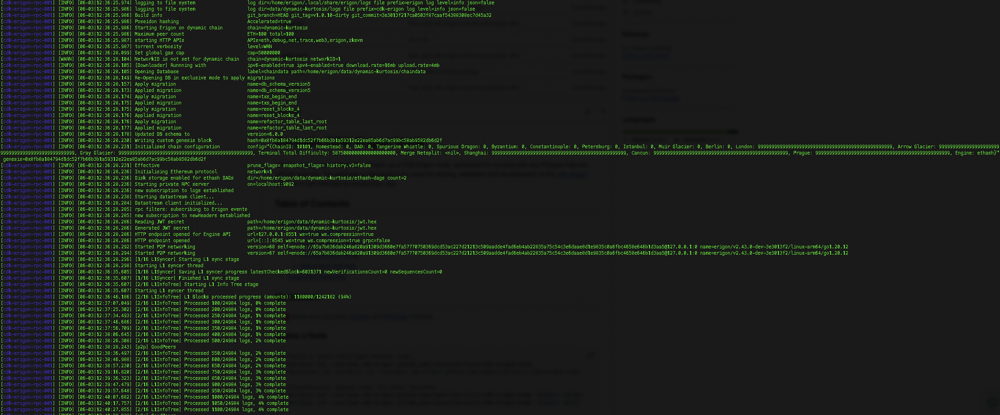

# Sync Erigon-CDK RPC against Cardona

Here's a straightforward guide to setting up a standalone CDK-Erigon RPC node against Cardona.

## 1. Configuration

Begin by specifying a set of parameters related to L1, L2, and CDK-Erigon configuration. Utilize the provided script for convenience.

```bash
./set-cardona-config.sh
```

Also make sure to modify the value of the RPC URL `l1_rpc_url` in `params.yml`.

## 2. Deployment

Now, you're all set to deploy your CDK-Erigon RPC node.

First, only enable the deployment of the cdk-erigon rpc node.

```bash
yq -Y --in-place 'with_entries(if .key == "deploy_cdk_erigon_rpc" then .value = true elif .value | type == "boolean" then .value = false else . end)' params.yml
```

Then deploy the components.

```bash
kurtosis run --enclave cdk-v1 --args-file params.yml --image-download always .
```

The RPC should start syncing.



## 3. Monitor

Monitor the state of your node using the following commands.

```bash
kurtosis service logs cdk-v1 cdk-erigon-rpc-001 --follow
```

To check if the node is syncing:

```bash
cast rpc eth_syncing --rpc-url $(kurtosis port print cdk-v1 cdk-erigon-rpc-001 rpc) | jq
```

During the syncing process, it will display a similar response.

```json
{
  "currentBlock": "0x0",
  "highestBlock": "0x0",
  "stages": [
    {
      "stage_name": "L1Syncer",
      "block_number": "0x5c080b"
    },
    {
      "stage_name": "Batches",
      "block_number": "0x0"
    },
    {
      "stage_name": "CumulativeIndex",
      "block_number": "0x0"
    },
    {
      "stage_name": "BlockHashes",
      "block_number": "0x0"
    },
    {
      "stage_name": "Senders",
      "block_number": "0x0"
    },
    {
      "stage_name": "Execution",
      "block_number": "0x0"
    },
    {
      "stage_name": "HashState",
      "block_number": "0x0"
    },
    {
      "stage_name": "IntermediateHashes",
      "block_number": "0x0"
    },
    {
      "stage_name": "LogIndex",
      "block_number": "0x0"
    },
    {
      "stage_name": "CallTraces",
      "block_number": "0x0"
    },
    {
      "stage_name": "TxLookup",
      "block_number": "0x0"
    },
    {
      "stage_name": "Finish",
      "block_number": "0x0"
    }
  ]
}
```

Once fully synced, the response will change accordingly.

```json
TODO
```

After full synchronization, querying the latest block number is possible.

Before full synchronization, querying the block number will return 0.

```bash
cast block-number --rpc-url $(kurtosis port print cdk-v1 cdk-erigon-rpc-001 rpc)
```
