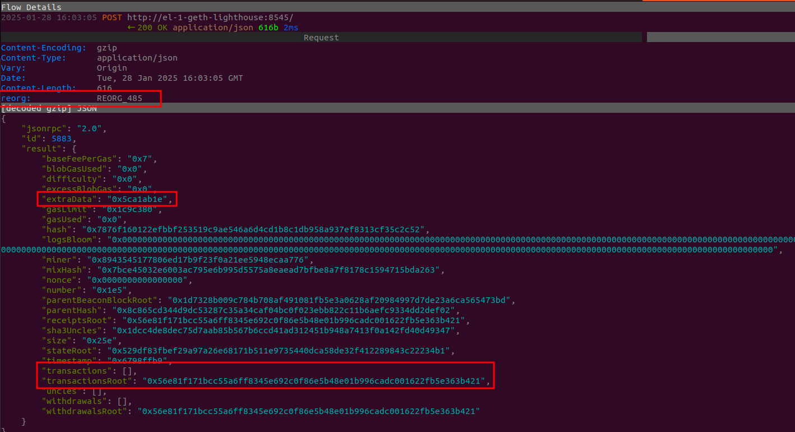
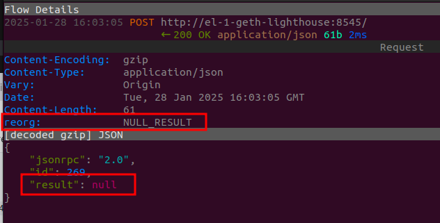

# MITM tests in Kurtosis

## Integrated MITM
There are option to set MITM as the L1 endpoint for many components:
- Agglayer
- AggKit
- Bridge
- DAC
- Erigon Sequencer
- Erigon RPC
- CDK-Node

To do so, you have to set to True the desired component.

    "mitm_proxied_components": {
        "agglayer": False,
        "aggkit": False,
        "bridge": False,
        "dac": False,
        "erigon-sequencer": False,
        "erigon-rpc": False,
        "cdk-node": False,
    }

With this, the component will send queries to MITM, and they will be forwarded to the real L1. You can modify ```/scripts/empty.py``` on the MITM service to achieve whatever you want.

## L1 misbehaving

Several L1 misbehaving scenarios had been implemented with MITM and can be easily tested.

You can test them all by just executing this [existing script](/scripts/mitm/test_l1_failures.sh) (from the repo's root folder)
```bash
./scripts/mitm/test_l1_failures.sh
```
Existing failures are implemented on [/scripts/mitm/failures.py](/scripts/mitm/failures.py), right now:
- ```HttpErrorResponse```: Returning random http error codes
- ```NullResponse```: Returning no data with 200 http code
- ```EmptyJSONResultResponse```: Returning JSON with empty result field
- ```EmptyJSONResponse```: Returning and empty JSON
- ```ArbitraryHTMLResponse```: Returning a fixed HTML content
- ```ArbitraryJSONResponse```: Returning a fixed JSON content
- ```SlowResponse```: Delay response for few seconds
- ```CorruptedJSONResponse```: Change a random byte on the returned JSON
- ```NoResponse```: Closing the HTTP connection without returning any answer
- ```AddJSONFieldsResponse```: Adding arbitrary JSON fields to the returned answer
- ```RedirectRequest```: Sending the request to a different(specified) server

## Reorg + Null answers

Run kurtosis setting ```l1_rpc_url``` to ```http://mitm:8234```

```bash
ENCLAVE_NAME=cdk
kurtosis run --enclave $ENCLAVE_NAME . '{"args":{"l1_rpc_url": "http://mitm:8234"}}'
```

As soon as you see Kurtosis executing steps (deploying L1), you can deploy the MITM image. If you run this too early (before Kurtosis starts the deployment), then the deployment fails with a "Address already in use", which is probably some kind of kurtosis bug.

This step is required to L1 contract deployment to work, so if you take too long to launch the docker, the contract deployment could fail as well.
```bash
ENCLAVE_NAME=cdk
docker run --detach --rm --name mitm -p 8234:8234 --network kt-${ENCLAVE_NAME} \
    mitmproxy/mitmproxy \
    mitmdump --mode reverse:http://el-1-geth-lighthouse:8545 -p 8234
```

Once Kurtosis is fully deployed, we proceed to set the real injection.

Firstly, we deploy an interactive MITM as we need to install some extra packages.
```bash
ENCLAVE_NAME=cdk

docker stop mitm

docker run -it --rm --name mitm -p 8234:8234 --network kt-${ENCLAVE_NAME} \
    mitmproxy/mitmproxy \
    bash
```

Then, inside the docker run these commands:

```bash
pip3 install rlp eth_utils pycryptodome

> mitm.py cat <<EOF
import json
import rlp
from eth_utils import keccak, to_hex
from random import randint


def block_hash(block: dict) -> str:
    fields = [
        'parentHash', 'sha3Uncles', 'miner', 'stateRoot', 'transactionsRoot',
        'receiptsRoot', 'logsBloom', 'difficulty', 'number', 'gasLimit',
        'gasUsed', 'timestamp', 'extraData', 'mixHash', 'baseFeePerGas',
        'withdrawalsRoot', 'blobGasUsed', 'excessBlobGas',
        'parentBeaconBlockRoot'
    ]
    numeric_fields = [
        'difficulty', 'number', 'gasLimit', 'gasUsed', 'timestamp',
        'baseFeePerGas', 'blobGasUsed', 'excessBlobGas'
    ]
    rlp_input = []

    if not isinstance(block, dict):
        return None
    if not all(x in block for x in fields):
        return None

    for x in fields:
        if x in numeric_fields:
            rlp_input.append(int(block[x], 16))
        else:
            rlp_input.append(
                bytes.fromhex(block[x][2:])
            )

        if x == 'mixHash':
            # nonce is set to 16 0s just after mix_Hash
            rlp_input.append(bytes.fromhex('0000000000000000'))

    rlp_encoded = rlp.encode(rlp_input)
    block_hash = to_hex(keccak(rlp_encoded))

    return block_hash


def fuck_block(block):
    _block_hash = block_hash(block)
    if not _block_hash:
        return block, False

    if _block_hash != block["hash"]:
        print(f"Found block hash issue: {_block_hash} vs {block['hash']}")
        return block, False

    block['extraData'] = '0x5ca1ab1e'
    block['transactions'] = []
    block['transactionsRoot'] = \
        '0x56e81f171bcc55a6ff8345e692c0f86e5b48e01b996cadc001622fb5e363b421'
    block["hash"] = block_hash(block)

    return block, True


class Reorg:
    def __init__(self, reorg_perc, null_perc):
        self.reorg_perc = reorg_perc
        self.null_perc = null_perc
        self.blocks_done = {}

    def response(self, flow):
        null_result = False
        do_reorg = False

        _i = randint(0, 99)
        if _i < self.null_perc:
            null_result = True
        else:
            _i = randint(0, 99)
            if _i < self.reorg_perc:
                do_reorg = True

        if not (null_result or do_reorg):
            return

        reorg_header = ""

        if flow.response.headers.get("Content-Type") == "application/json":
            body = json.loads(flow.response.text)
            if not isinstance(body, dict):
                return

            if null_result:
                body["result"] = None
                flow.response.text = json.dumps(body)
                reorg_header = "NULL_RESULT"
            else:
                _result = body.get("result", {})
                if not isinstance(_result, dict):
                    reorg_header = "NOT_A_DICT"
                else:
                    _block_number = int(_result.get("number", "0x0"), 16)
                    _peer = flow.client_conn.peername
                    _peer_addr = _peer[0] if _peer else "UNKNOWN"

                    self.blocks_done[_peer_addr] = \
                        self.blocks_done.get(_peer_addr, [])

                    if _block_number == 0:
                        reorg_header = "ZERO_BLOCK"
                    else:
                        if _block_number in self.blocks_done.get(_peer_addr):
                            reorg_header = \
                                f"BLOCK_ALREADY_REORGED_{_block_number}"
                        else:
                            result, modified = fuck_block(body["result"])
                            if modified:
                                self.blocks_done[_peer_addr] \
                                    .append(_block_number)
                                body["result"] = result
                                flow.response.text = json.dumps(body)
                                reorg_header = f"REORG_{_block_number}"
                            else:
                                reorg_header = "NOT_MODIFIED"
        else:
            reorg_header = "NO_JSON"

        flow.response.headers["reorg"] = reorg_header


reorg_percentage = 40
null_result_percentage = 20

addons = [
    Reorg(reorg_percentage, null_result_percentage)
]
EOF

mitmproxy --mode reverse:http://el-1-geth-lighthouse:8545 -p 8234 -s mitm.py 
```

At that point the "fault" is already working.

By inspecting answers, you can see extra headers added to help understanding if that has been modified.

Modified block will have that header, no transactions, and fixed extraData:




Answers with removed result, will have that header:


