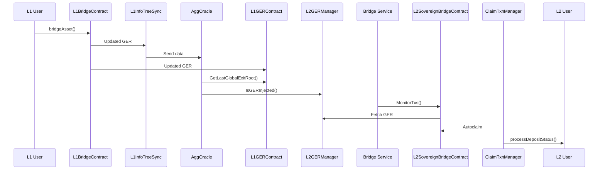
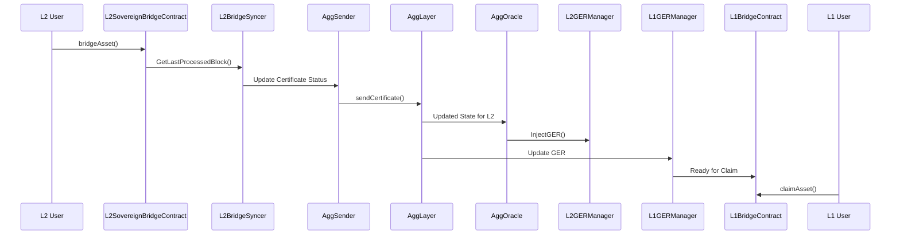

# OP Sovereign Rollup

## Table of Contents

- [OP Sovereign Rollup](#op-sovereign-rollup)
  - [Table of Contents](#table-of-contents)
  - [Integration Details](#integration-details)
    - [OP Sovereign Infrastructure Overview](#op-sovereign-infrastructure-overview)
    - [OP Sovereign Contracts Setup](#op-sovereign-contracts-setup)
    - [OP Sovereign Bridge Setup](#op-sovereign-bridge-setup)
  - [Running OP Rollup](#running-op-rollup)
  - [Running OP Succinct](#running-op-succinct)
    - [OP Succinct Contracts Setup](#op-succinct-contracts-setup)
  - [Testing](#testing)
    - [L2 Finalized Block Number](#l2-finalized-block-number)
    - [E2E Bridge Scenario Tests](#e2e-bridge-scenario-tests)
      - [L1 -\> L2 Bridge](#l1---l2-bridge)
      - [L2 -\> L1 Bridge](#l2---l1-bridge)
  - [Sovereign Bridging Sequence Diagram](#sovereign-bridging-sequence-diagram)
    - [L1 -\> L2 Sovereign Bridge Flow](#l1---l2-sovereign-bridge-flow)
    - [L2 Sovereign -\> L1 Bridge Flow](#l2-sovereign---l1-bridge-flow)

---

## Integration Details

The OP Stack within Kurtosis CDK is implemented as a sovereign rollup. The deployment process follows this sequence:

1. L1 infrastructure
2. CDK/zkEVM components
3. Agglayer infrastructure
4. OP Stack and Aggkit components

### OP Sovereign Infrastructure Overview

When `deploy_optimism_rollup` is set to `True`, the CDK Erigon infrastructure deployments are skipped, and the following components are deployed:

- **L1 Infrastructure**: Execution and consensus clients
- **zkEVM Contracts**: Deployed on L1, including:
  - RollupManager
  - Bridge
  - GER contracts
- **Agglayer**
- **OP Stack Components**:
  - op-geth
  - op-node
  - op-batcher
  - op-proposer
  - op-challenger
  - Sovereign contracts (See [OP Sovereign Contracts Setup](#op-sovereign-contracts-setup))
  - Sovereign bridge service infrastructure
  - Aggkit infrastructure (AggOracle and AggSender)
- **OP Succinct (if enabled)**:
  - op-succinct-contract-deployer
  - op-succinct-server
  - op-succinct-proposer

### OP Sovereign Contracts Setup

The setup process consists of two main steps:

1. **Create New Rollup Onchain**

   - Uses the script: [createNewRollup.ts](https://github.com/0xPolygonHermez/zkevm-contracts/blob/v10.0.0-rc.1/tools/createNewRollup/createNewRollup.ts)
   - Configuration file: `create_new_rollup.json`

   ```json
   {
     "type": "EOA",
     "trustedSequencerURL": "http://op-el-1-op-geth-op-node-op-kurtosis:8545",
     "networkName": "op-sovereign",
     "trustedSequencer": "0x635243A11B41072264Df6c9186e3f473402F94e9",
     "chainID": 2151908,
     "rollupAdminAddress": "0x635243A11B41072264Df6c9186e3f473402F94e9",
     "consensusContractName": "PolygonPessimisticConsensus",
     "gasTokenAddress": "0x0000000000000000000000000000000000000000",
     "deployerPvtKey": "0x12d7de8621a77640c9241b2595ba78ce443d05e94090365ab3bb5e19df82c625",
     "maxFeePerGas": "",
     "maxPriorityFeePerGas": "",
     "multiplierGas": "",
     "timelockDelay": 0,
     "timelockSalt": "",
     "rollupManagerAddress": "0x6c6c009cC348976dB4A908c92B24433d4F6edA43",
     "rollupTypeId": 1,
     "isVanillaClient": true,
     "sovereignParams": {
       "bridgeManager": "0x635243A11B41072264Df6c9186e3f473402F94e9",
       "sovereignWETHAddress": "0x0000000000000000000000000000000000000000",
       "sovereignWETHAddressIsNotMintable": false,
       "globalExitRootUpdater": "0x635243A11B41072264Df6c9186e3f473402F94e9",
       "globalExitRootRemover": "0x635243A11B41072264Df6c9186e3f473402F94e9"
     }
   }
   ```

2. **Deploy Sovereign Contracts**

   - Contracts deployed on OP network:
     - `BridgeL2SovereignChain`
     - `GlobalExitRootManagerL2SovereignChain`
     - Associated proxies
   - Output saved in a file:

   ```json
   {
     "sovereignRollupContract": "0xcC626369bD1ff281b22B2dfA71ce0B4776A16568",
     "rollupChainID": "2151908",
     "verifier": "0xf22E2B040B639180557745F47aB97dFA95B1e22a",
     "forkID": "12",
     "lastLocalExitRoot": "0x0000000000000000000000000000000000000000000000000000000000000000",
     "lastBatchSequenced": "0",
     "lastVerifiedBatch": "0",
     "_legacyLastPendingState": "0",
     "_legacyLastPendingStateConsolidated": "0",
     "lastVerifiedBatchBeforeUpgrade": "0",
     "rollupTypeID": "1",
     "rollupVerifierType": "1",
     "bridge_impl_addr": "0x2ECfD134955De2b504564Cc28966160244DF0175",
     "ger_impl_addr": "0x9b7b679B2dD577B6116648C6fB6af6A365e408DA",
     "ger_proxy_addr": "0x494990B3d02A31718c22fdCd520cAa4C55f710B3",
     "bridge_proxy_addr": "0x0ba8688239009E5748895b06D30556040b0866b5"
   }
   ```

### OP Sovereign Bridge Setup

The bridge deployment mirrors the CDK Erigon bridge setup. For a detailed end-to-end explanation, see [Sovereign Bridging Sequence Diagram](#sovereign-bridging-sequence-diagram).

---

## Running OP Rollup

To deploy OP Rollup in isolation (without CDK Erigon Stack):

1. Edit `input_parser.star`
2. Set:

   ```starlark
   DEFAULT_DEPLOYMENT_STAGES = {
       "deploy_optimism_rollup": True,
   }
   DEFAULT_ARGS = (
       {
           "consensus_contract_type": "pessimistic",
       }
   )
   ```

---

## Running OP Succinct

Run the following command:

```
kurtosis run --enclave=cdk --args-file ./.github/tests/chains/op-succinct.yml .
```

Key configuration requirements in `op-succinct.yml`:

```starlark
DEFAULT_DEPLOYMENT_STAGES = {
    "deploy_optimism_rollup": True,
    "deploy_op_succinct": True,
}

DEFAULT_ARGS = (
    {
        "consensus_contract_type": "pessimistic",
    }
)

DEFAULT_ROLLUP_ARGS = {
    "sp1_prover_key": <SPN_KEY>,
}

DEFAULT_OP_STACK_ARGS = {
    "chains": [
        {
            "participants": [
                {
                    "el_type": "op-geth",
                    "el_image": "us-docker.pkg.dev/oplabs-tools-artifacts/images/op-geth:latest",
                    "cl_type": "op-node",
                    "cl_image": "us-docker.pkg.dev/oplabs-tools-artifacts/images/op-node:develop",
                    "count": 1,
                },
            ],
            "batcher_params": {
                "image": "us-docker.pkg.dev/oplabs-tools-artifacts/images/op-batcher:develop",
            },
            "proposer_params": {
                "image": "us-docker.pkg.dev/oplabs-tools-artifacts/images/op-proposer:develop",
            },
        },
    ],
    "op_contract_deployer_params": {
        "image": "us-docker.pkg.dev/oplabs-tools-artifacts/images/op-deployer:v0.0.12",
        "l1_artifacts_locator": "https://storage.googleapis.com/oplabs-contract-artifacts/artifacts-v1-fffcbb0ebf7f83311791534a41e65ef90df47797f9ca8f86941452f597f7128c.tar.gz",
        "l2_artifacts_locator": "https://storage.googleapis.com/oplabs-contract-artifacts/artifacts-v1-fffcbb0ebf7f83311791534a41e65ef90df47797f9ca8f86941452f597f7128c.tar.gz",
    },
}
```

Additional configurable parameters:

```
op_succinct_range_proof_interval: "60" # The number of blocks to include in each range proof.
op_succinct_submission_interval: "100" # Minimum L2 block interval for checkpoints
```

### OP Succinct Contracts Setup

Refer to [official docs](https://succinctlabs.github.io/op-succinct/quick-start/mock.html) for more details.

Steps:

1. Create `.env` file
2. Deploy contracts using:
   - `DeployMockVerifier` (mock SP1 verifier)
   - `OPSuccinctDeployer` (`OPSuccinctL2OutputOracle`)
3. Configure `op-succinct-proposer` and `op-succinct-server`

---

## Testing

Verify functionality with these methods:

### L2 Finalized Block Number

Check if L2 block number increases:

```
cast rpc --rpc-url $(kurtosis port print cdk op-cl-1-op-node-op-geth-001 http) optimism_syncStatus | jq '.finalized_l2'
```

Example output:

```json
{
  "hash": "0x4fdc220679f2b7496570d63ec3a9fce79d410efb1ef1e951a895faab0b4bf5e8",
  "number": 161,
  "parentHash": "0x9f82ff40ad8638ac6c2de65927d1c75718dd914cc8233795be6325bfba804a34",
  "timestamp": 1740545860,
  "l1origin": {
    "hash": "0x227d356f36783aad905391cc2726045a2a31a9a3cacfde04b8a1deaa6a346cc2",
    "number": 236
  },
  "sequenceNumber": 0
}
```

For OP-Succinct, check proposer logs:

```
kurtosis service logs cdk op-succinct-proposer-001 -f
```

Look for `L2FinalizedBlock` in logs:

```
t=2025-02-26T05:04:45+0000 lvl=info msg="Proposer status" metrics="{L2UnsafeHeadBlock:373 L2FinalizedBlock:161 ...}"
```

Or use Succinct Explorer: `https://network.succinct.xyz/requester/<YOUR_SPN_ADDRESS>`

### E2E Bridge Scenario Tests

#### L1 -> L2 Bridge

```
l1_prefunded_mnemonic="giant issue aisle success illegal bike spike question tent bar rely arctic volcano long crawl hungry vocal artwork sniff fantasy very lucky have athlete"
private_key=$(cast wallet private-key --mnemonic "$l1_prefunded_mnemonic")
eth_address=$(cast wallet address --private-key $private_key)

polycli ulxly bridge asset \
    --bridge-address 0x83F138B325164b162b320F797b57f6f7E235ABAC \
    --destination-network 2 \
    --private-key $private_key \
    --rpc-url http://$(kurtosis port print cdk el-1-geth-lighthouse rpc) \
    --value 10000000000000000000
```

Verify balance:

```
cast balance --ether --rpc-url $(kurtosis port print cdk op-el-1-op-geth-op-node-op-kurtosis rpc) $eth_address
# Expected: 10.000000000000000000
```

#### L2 -> L1 Bridge

```
polycli ulxly bridge asset \
    --bridge-address 0x0ba8688239009E5748895b06D30556040b0866b5 \
    --destination-network 0 \
    --private-key $private_key \
    --rpc-url $(kurtosis port print cdk op-el-1-op-geth-op-node-op-kurtosis rpc) \
    --value $(date +%s) \
    --destination-address 0xC0FFEE0000000000000000000000000000000001
```

Check bridge service:

```
curl $(kurtosis port print cdk zkevm-bridge-service-001 rpc)/bridges/0xC0FFEE0000000000000000000000000000000001 | jq '.'
```

Example output:

```json
{
  "deposits": [
    {
      "leaf_type": 0,
      "orig_net": 0,
      "orig_addr": "0x0000000000000000000000000000000000000000",
      "amount": "1740546568",
      "dest_net": 0,
      "dest_addr": "0xC0FFEe0000000000000000000000000000000001",
      "block_num": "517",
      "deposit_cnt": 0,
      "network_id": 2,
      "tx_hash": "0x57515bfe8f5fed404ad36d76b5040ce0257b23873170ca7fbd0c7a84f73839c4",
      "claim_tx_hash": "",
      "metadata": "0x",
      "ready_for_claim": true,
      "global_index": "4294967296"
    }
  ],
  "total_cnt": "1"
}
```

When `ready_for_claim` is `true`, claim:

```
polycli ulxly claim asset \
    --bridge-address 0x83F138B325164b162b320F797b57f6f7E235ABAC \
    --bridge-service-url $(kurtosis port print cdk zkevm-bridge-service-001 rpc) \
    --deposit-count 0 \
    --destination-address 0xc0FFee0000000000000000000000000000000001 \
    --deposit-network 2 \
    --private-key $private_key \
    --rpc-url http://$(kurtosis port print cdk el-1-geth-lighthouse rpc)
```

Verify L1 balance:

```
cast balance --ether --rpc-url http://$(kurtosis port print cdk el-1-geth-lighthouse rpc) 0xc0FFee0000000000000000000000000000000001
# Expected: 0.000000001740546568
```

---

## Sovereign Bridging Sequence Diagram

### L1 -> L2 Sovereign Bridge Flow



### L2 Sovereign -> L1 Bridge Flow


