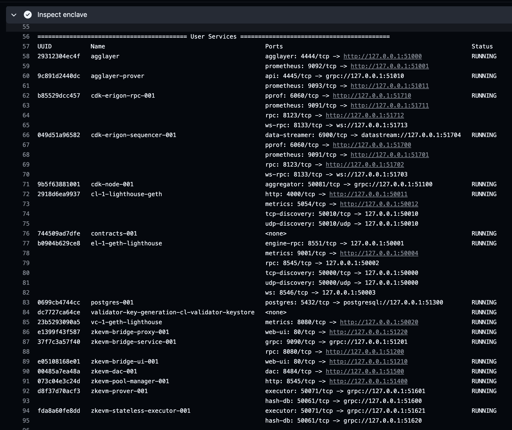
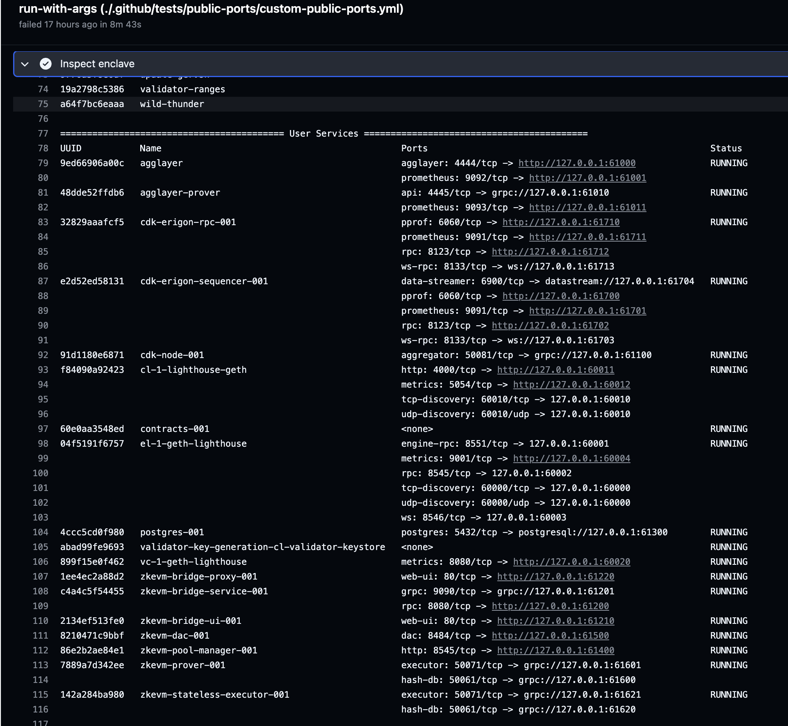
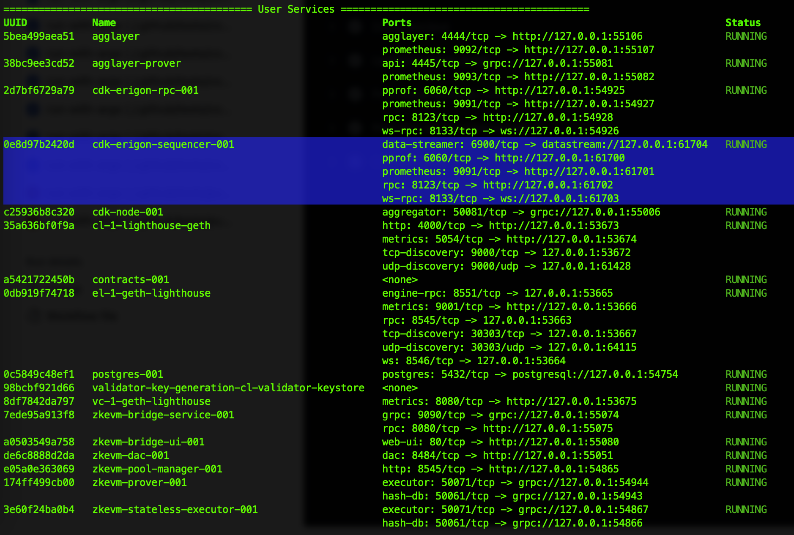

# Static Ports

The goal of this feature is to make it easier to work with the Kurtosis CDK stack. This eliminates the need for developers to create additional scripts to fetch the ports of various services and modify their configurations.

Indeed, Kurtosis binds the ports of enclave services to dynamic or [ephemeral ports](https://unix.stackexchange.com/questions/65475/ephemeral-port-what-is-it-and-what-does-it-do) on the host machine. To quote the Kurtosis [documentation](https://docs.kurtosis.com/advanced-concepts/public-and-private-ips-and-ports/#public-ips--ports), "these ephemeral ports are called the "public ports" of the container because they allow the container to be accessed outside the Docker/Kubernetes cluster".

To view the private and public port bindings of each container, one can run `kurtosis enclave inspect <enclave-name>` and look for the bindings in the "Ports" column. It is also possible to get the public port binding of a specific service port using `kurtosis port print <enclave-name> <service-name> <port-name>`. For example, `kurtosis port print cdk cdk-erigon-rpc-001 rpc` will print the `rpc` port of the cdk-erigon rpc.

## How does it work?

Each service is assigned a "start port" that indicates the port number where it will begin exposing public ports. For example, if our service `xyz` has its start port set to 1000 and it exposes three ports, the first port a will be available at 1000, the second port b will be at 1001, and the third port c will be at 1002. We refer to such ports as "static ports", as opposed to "dynamic" or "ephemeral" ports set by Kurtosis.

By default, the package will expose ports dynamically using Kurtosis, as it has always been the case.

Let's take a look at the different configurations.

### 1. Use the default static ports

We define default static ports in `input_parser.star`.

L1 services will be exposed on the range 50000-50999 and L2 services on the range 51000-51999.

```bash
cat ./.github/tests/static-ports/default-static-ports.yml
```

You can deploy the stack using:

```bash
kurtosis run --enclave cdk --args-file ./.github/tests/static-ports/default-static-ports.yml .
```

You would get the following result:



This is quite useful for testing. For example, now we know that the cdk-erigon sequencer will always be exposed on port 51704, unless the port config changes.

### 2. Define custom static ports

You can also define custom static ports.

Here is an example where all the services are assigned static ports.

> Note that you can also define custom static ports for a subset of services. The other services ports will be assigned dynamically by Kurtosis. 

```bash
cat ./.github/tests/static-ports/custom-static-ports.yml
```

You can deploy the stack using:

```bash
kurtosis run --enclave cdk --args-file ./.github/tests/static-ports/custom-static-ports.yml .
```

You would get the following result:



Finally, here's another scenario in which only the static port of the cdk-erigon sequencer is specified.

```bash
cat ./.github/tests/static-ports/custom-static-ports-cdk-erigon-sequencer-ds.yml
```

Here is how to deploy the stack:

```bash
kurtosis run --enclave cdk --args-file ./.github/tests/static-ports/custom-static-ports-cdk-erigon-sequencer-ds.yml .
```

Here is the result:



As you can see, most of the services are assigned dynamic ports except the cdk-erigon sequencer. For example, the cdk-erigon sequencer datastream port is exposed on port 61704.
