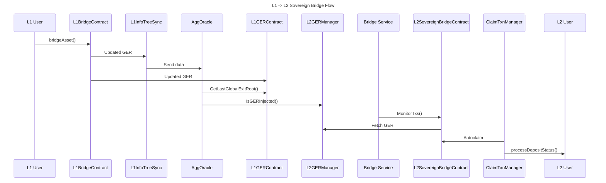
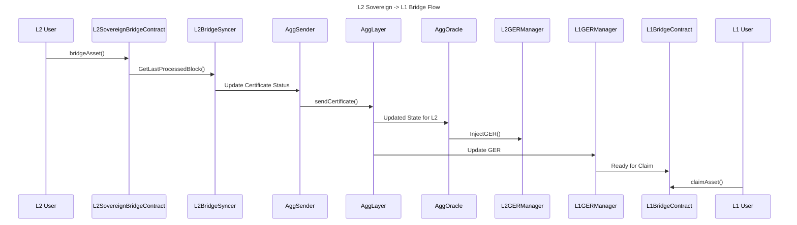

# OP Sovereign Rollup

## Deploying OP Rollup

Change the `deploy_optimism_rollup` parameter to `True` and `consensus_contract_type` to `pessimistic`:

```
DEFAULT_DEPLOYMENT_STAGES = {
    ...
    "deploy_optimism_rollup": True,
    ...
}

...

DEFAULT_ARGS = (
    {
        ...
        "consensus_contract_type": "pessimistic",
        ...
    }
)
```

## Deploying OP Succinct

This requires more precise configuration to correctly run. Reference the below parameters - the `DEFAULT_OP_STACK_ARGS` versions must be exact:

```
DEFAULT_DEPLOYMENT_STAGES = {
    ...
    "deploy_optimism_rollup": True,
    # After deploying OP Stack, upgrade it to OP Succinct.
    # Even mock-verifier deployments require an actual SPN network key.
    "deploy_op_succinct": True,
    ...
}

...

DEFAULT_ARGS = (
    {
        ...
        "consensus_contract_type": "pessimistic",
        ...
    }
)

...

DEFAULT_ROLLUP_ARGS = {
    "agglayer_prover_sp1_key": <VALID_SPN_KEY>,
}

...

DEFAULT_OP_STACK_ARGS = {
    "chains": [
        {
            "participants": [
                {
                    "el_type": "op-geth",
                    "el_image": "us-docker.pkg.dev/oplabs-tools-artifacts/images/op-geth:v1.101411.3",
                    "cl_type": "op-node",
                    "cl_image": "us-docker.pkg.dev/oplabs-tools-artifacts/images/op-node:v1.10.1",
                    "count": 1,
                },
            ],
            "batcher_params": {
                "image": "us-docker.pkg.dev/oplabs-tools-artifacts/images/op-batcher:v1.10.0",
            },
            "proposer_params": {
                "image": "us-docker.pkg.dev/oplabs-tools-artifacts/images/op-proposer:v1.9.5",
            },
        },
    ],
    "op_contract_deployer_params": {
        "image": "us-docker.pkg.dev/oplabs-tools-artifacts/images/op-deployer:v0.0.11",
        "l1_artifacts_locator": "https://storage.googleapis.com/oplabs-contract-artifacts/artifacts-v1-c193a1863182092bc6cb723e523e8313a0f4b6e9c9636513927f1db74c047c15.tar.gz",
        "l2_artifacts_locator": "https://storage.googleapis.com/oplabs-contract-artifacts/artifacts-v1-c193a1863182092bc6cb723e523e8313a0f4b6e9c9636513927f1db74c047c15.tar.gz",
    },
}

```

## Sovereign Bridging Sequence Diagram


---

