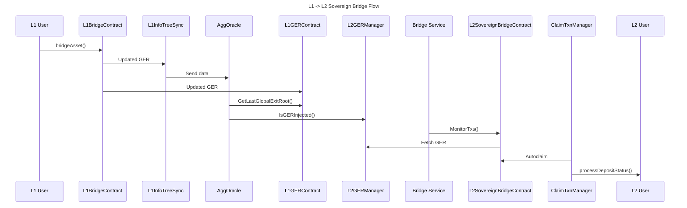
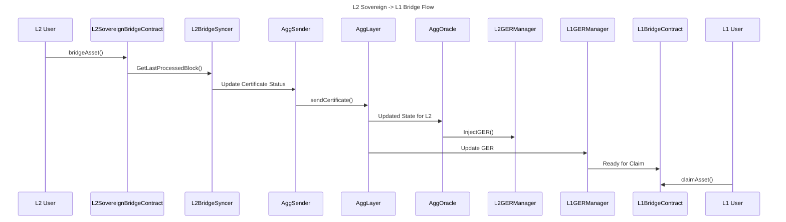

# OP Sovereign Rollup

## Table of Contents
- [OP Sovereign Rollup](#op-sovereign-rollup)
  - [Table of Contents](#table-of-contents)
  - [Integration Details](#integration-details)
    - [OP Sovereign Infrastructure Overview](#op-sovereign-infrastructure-overview)
    - [OP Sovereign Contracts Setup](#op-sovereign-contracts-setup)
    - [OP Sovereign Bridge Setup](#op-sovereign-bridge-setup)
  - [Running OP Rollup](#running-op-rollup)
  - [Running OP Succinct](#running-op-succinct)
    - [OP Succinct Contracts Setup](#op-succinct-contracts-setup)
  - [Testing](#testing)
    - [L2 Finalized Block Number](#l2-finalized-block-number)
    - [E2E Bridge Scenario Tests](#e2e-bridge-scenario-tests)
  - [Sovereign Bridging Sequence Diagram](#sovereign-bridging-sequence-diagram)

## Integration Details

The OP Stack within Kurtosis CDK is attached as a sovereign rollup. This means the L1, CDK/zkEVM, and Agglayer infrastructure is deployed first, then the OP Stack and Aggkit components are deployed and attached.

### OP Sovereign Infrastructure Overview
When `deploy_optimism_rollup` is set to `True`, it will skip the CDK Erigon infrastructure deployments and proceed with the deployments of:
- L1 infra (execution + consensus clients).
- zkEVM contracts onto the deployed L1 - including the RollupManager, Bridge, GER contracts.
- Agglayer
- OP Stack
  - op-geth, op-node, op-batcher, op-proposer, and op-challenger
  - Sovereign contracts deployment. Refer to [OP Sovereign Contracts Setup](#op-sovereign-contracts-setup) for more details.
  - Sovereign bridge service infrastructure 
  - Aggkit infrastructure (AggOracle, and AggSender)
- (If enabled) OP Succinct
  - op-succinct-contract-deployer to deploy the op-succinct specific contracts and setup the deployment
  - op-succinct-server, op-succinct-proposer

### OP Sovereign Contracts Setup
This step can be summarized in two steps:
1. Create new rollup onchain by calling the RollupManager contract
2. Deploy sovereign contracts

The first step is done by using the [createNewRollup.ts](https://github.com/0xPolygonHermez/zkevm-contracts/blob/v10.0.0-rc.1/tools/createNewRollup/createNewRollup.ts) script within the zkevm-contracts repo.

A `create_new_rollup.json` file is created as the input file for the script:
```
{
    "type":"EOA",
    "trustedSequencerURL": "http://op-el-1-op-geth-op-node-op-kurtosis:8545",
    "networkName": "op-sovereign",
    "trustedSequencer": "0x635243A11B41072264Df6c9186e3f473402F94e9",
    "chainID": 2151908,
    "rollupAdminAddress": "0x635243A11B41072264Df6c9186e3f473402F94e9",
    "consensusContractName": "PolygonPessimisticConsensus",
    "gasTokenAddress": "0x0000000000000000000000000000000000000000",
    "deployerPvtKey": "0x12d7de8621a77640c9241b2595ba78ce443d05e94090365ab3bb5e19df82c625",
    "maxFeePerGas": "",
    "maxPriorityFeePerGas": "",
    "multiplierGas": "",
    "timelockDelay": 0,
    "timelockSalt": "",
    "rollupManagerAddress":"0x2F50ef6b8e8Ee4E579B17619A92dE3E2ffbD8AD2",
    "rollupTypeId": 1,
    "isVanillaClient": true,
    "sovereignParams": {
        "bridgeManager": "0x635243A11B41072264Df6c9186e3f473402F94e9",
        "sovereignWETHAddress": "0x0000000000000000000000000000000000000000",
        "sovereignWETHAddressIsNotMintable": false,
        "globalExitRootUpdater": "0x635243A11B41072264Df6c9186e3f473402F94e9",
        "globalExitRootRemover": "0x635243A11B41072264Df6c9186e3f473402F94e9"
    }
}
```

Then the [sovereign contracts](https://github.com/0xPolygonHermez/zkevm-contracts/tree/v10.0.0-rc.1/contracts/v2/sovereignChains) `BridgeL2SovereignChain`, `GlobalExitRootManagerL2SovereignChain` and their proxies are deployed on the OP network. The output information is then saved in a file:

```
{
  "sovereignRollupContract": "0xcC626369bD1ff281b22B2dfA71ce0B4776A16568",
  "sovereignChainID": "2151908",
  "verifier": "0xf22E2B040B639180557745F47aB97dFA95B1e22a",
  "forkID": "12",
  "lastLocalExitRoot": "0x0000000000000000000000000000000000000000000000000000000000000000",
  "lastBatchSequenced": "0",
  "lastVerifiedBatch": "0",
  "_legacyLastPendingState": "0",
  "_legacyLastPendingStateConsolidated": "0",
  "lastVerifiedBatchBeforeUpgrade": "0",
  "rollupTypeID": "1",
  "rollupVerifierType": "1",
  "bridge_impl_addr": "0x2ECfD134955De2b504564Cc28966160244DF0175",
  "ger_impl_addr": "0x9b7b679B2dD577B6116648C6fB6af6A365e408DA",
  "ger_proxy_addr": "0x494990B3d02A31718c22fdCd520cAa4C55f710B3",
  "bridge_proxy_addr": "0x0ba8688239009E5748895b06D30556040b0866b5"
}
```

### OP Sovereign Bridge Setup
The OP Sovereign bridge deployment is identical to the CDK Erigon bridge deployment. The [reference config](https://github.com/0xPolygon/kurtosis-cdk/blob/v0.2.31/templates/sovereign-rollup/sovereign-bridge-config.toml) will show the parameters are changed accordingly.

For more details on how the sovereign bridge works e2e, refer to the [Sovereign Bridging Sequence Diagram](#sovereign-bridging-sequence-diagram) section.

## Running OP Rollup

The default behavior for deploying OP Rollup in Kurtosis CDK is isolated - only the OP Sovereign Stack will be deployed and the CDK Erigon Stack will not be deployed.
Under `input_parser.star` change the `deploy_optimism_rollup` parameter to `True` and `consensus_contract_type` to `pessimistic`:

```
DEFAULT_DEPLOYMENT_STAGES = {
    "deploy_optimism_rollup": True,
}


DEFAULT_ARGS = (
    {
        "consensus_contract_type": "pessimistic",
    }
)
```

## Running OP Succinct

Simply run `kurtosis run --enclave=cdk --args-file ./.github/tests/chains/op-succinct.yml .`
You can inspect the `op-succinct.yml` file to understand the changes - this requires more precise configuration to correctly run. Reference the below parameters - the `DEFAULT_OP_STACK_ARGS` versions must be exact:

```
DEFAULT_DEPLOYMENT_STAGES = {
    "deploy_optimism_rollup": True,
    # After deploying OP Stack, upgrade it to OP Succinct.
    # Even mock-verifier deployments require an actual SPN network key.
    "deploy_op_succinct": True,
}


DEFAULT_ARGS = (
    {
        "consensus_contract_type": "pessimistic",
    }
)


DEFAULT_ROLLUP_ARGS = {
    "agglayer_prover_sp1_key": <SPN_KEY>,
}


DEFAULT_OP_STACK_ARGS = {
    "chains": [
        {
            "participants": [
                {
                    "el_type": "op-geth",
                    "el_image": "us-docker.pkg.dev/oplabs-tools-artifacts/images/op-geth:latest",
                    "cl_type": "op-node",
                    "cl_image": "us-docker.pkg.dev/oplabs-tools-artifacts/images/op-node:develop",
                    "count": 1,
                },
            ],
            "batcher_params": {
                "image": "us-docker.pkg.dev/oplabs-tools-artifacts/images/op-batcher:develop",
            },
            "proposer_params": {
                "image": "us-docker.pkg.dev/oplabs-tools-artifacts/images/op-proposer:develop",
            },
        },
    ],
    "op_contract_deployer_params": {
        "image": "us-docker.pkg.dev/oplabs-tools-artifacts/images/op-deployer:v0.0.12",
        "l1_artifacts_locator": "https://storage.googleapis.com/oplabs-contract-artifacts/artifacts-v1-fffcbb0ebf7f83311791534a41e65ef90df47797f9ca8f86941452f597f7128c.tar.gz",
        "l2_artifacts_locator": "https://storage.googleapis.com/oplabs-contract-artifacts/artifacts-v1-fffcbb0ebf7f83311791534a41e65ef90df47797f9ca8f86941452f597f7128c.tar.gz",
    },
}

```

There are additional OP-Succinct specific parameters which are configurable such as:

```
  # The maximum number of blocks to include in each span proof. For chains with high throughput, you need to decrease this value.
  op_succinct_proposer_span_proof: "50"
  # The minimum interval in L2 blocks at which checkpoints must be submitted. An aggregation proof can be posted for any range larger than this interval.
  op_succinct_submission_interval: "100"
```

### OP Succinct Contracts Setup
Before further reading, note there are more details in the [official docs](https://succinctlabs.github.io/op-succinct/quick-start/mock.html).

Similar to the previous OP Stack, OP-Succinct requires additional setup. First, an `.env` file is created and used to run the OP-Succinct contracts deployment scripts `DeployMockVerifier` to deploy the mock SP1 verifier contract and `OPSuccinctDeployer` to deploy the `OPSuccinctL2OutputOracle` contract.

These are saved and used to configure the `op-succint-proposer` and `op-succinct-server` services which are responsible for requesting proofs to the SP1 provers and updating the L2 state.

## Testing

To verify the OP Stack within Kurtosis CDK is working correctly, there are few steps one can take:
- Verify that the finalized block number on L2 is increasing
- Verify the e2e sovereign bridge scenarios

### L2 Finalized Block Number
To test the L2 block number is increasing, a simple `cast` call can be made to the op-geth rpc.
```
$ cast rpc --rpc-url $(kurtosis port print cdk op-cl-1-op-node-op-geth-op-kurtosis http) optimism_syncStatus | jq '.finalized_l2'
```

Note the `number` value in the output.
```
{
  "hash": "0x4fdc220679f2b7496570d63ec3a9fce79d410efb1ef1e951a895faab0b4bf5e8",
  "number": 161,
  "parentHash": "0x9f82ff40ad8638ac6c2de65927d1c75718dd914cc8233795be6325bfba804a34",
  "timestamp": 1740545860,
  "l1origin": {
    "hash": "0x227d356f36783aad905391cc2726045a2a31a9a3cacfde04b8a1deaa6a346cc2",
    "number": 236
  },
  "sequenceNumber": 0
}
```

Similarly, in OP-Succinct, this can be verified by looking at the logs of the op-succinct-proposer service.
```
kurtosis service logs cdk op-succinct-proposer-001 -f
```
Monitor the logs and look at `L2FinalizedBlock`.
```
[op-succinct-proposer-001] t=2025-02-26T05:04:45+0000 lvl=info msg="Proposer status" metrics="{L2UnsafeHeadBlock:373 L2FinalizedBlock:161 LatestContractL2Block:100 HighestProvenContiguousL2Block:150 MinBlockToProveToAgg:200 NumProving:0 NumWitnessgen:0 NumUnrequested:0}"
[op-succinct-proposer-001] t=2025-02-26T05:04:45+0000 lvl=info msg="Stage 1: Getting Range Proof Boundaries..."
[op-succinct-proposer-001] t=2025-02-26T05:04:45+0000 lvl=info msg="Stage 2: Processing PROVING requests..."
[op-succinct-proposer-001] t=2025-02-26T05:04:45+0000 lvl=info msg="Stage 3: Processing WITNESSGEN requests..."
[op-succinct-proposer-001] t=2025-02-26T05:04:45+0000 lvl=info msg="Stage 4: Deriving Agg Proofs..."
[op-succinct-proposer-001] t=2025-02-26T05:04:45+0000 lvl=info msg="Stage 5: Requesting Queued Proofs..."
[op-succinct-proposer-001] t=2025-02-26T05:04:45+0000 lvl=info msg="Stage 6: Submitting Agg Proofs..."
```

Another option is to look at the succinct explorer - `https://network.succinct.xyz/requester/<YOUR_SPN_ADDRESS>`

### E2E Bridge Scenario Tests

First bridge from L1 -> OP L2. The deposits should be autoclaimed on the OP network.
```
# L1 -> L2
l1_prefunded_mnemonic="giant issue aisle success illegal bike spike question tent bar rely arctic volcano long crawl hungry vocal artwork sniff fantasy very lucky have athlete"
private_key=$(cast wallet private-key --mnemonic "$l1_prefunded_mnemonic")
eth_address=$(cast wallet address --private-key $private_key)

# bridge 10 ether to our sov chain
polycli ulxly bridge asset \
    --bridge-address 0x83F138B325164b162b320F797b57f6f7E235ABAC \
    --destination-network 2 \
    --private-key $private_key \
    --rpc-url http://$(kurtosis port print cdk el-1-geth-lighthouse rpc) \
    --value 10000000000000000000 
```

Check that the balance of the deposit address has increased.
```
$ cast balance --ether --rpc-url $(kurtosis port print cdk op-el-1-op-geth-op-node-op-kurtosis rpc) $eth_address

10.000000000000000000
```

Then bridge from L2 -> L1 again.
```
# L2 -> L1
l1_prefunded_mnemonic="giant issue aisle success illegal bike spike question tent bar rely arctic volcano long crawl hungry vocal artwork sniff fantasy very lucky have athlete"
private_key=$(cast wallet private-key --mnemonic "$l1_prefunded_mnemonic")
eth_address=$(cast wallet address --private-key $private_key)
polycli ulxly bridge asset \
    --bridge-address 0x0ba8688239009E5748895b06D30556040b0866b5 \
    --destination-network 0 \
    --private-key $private_key \
    --rpc-url $(kurtosis port print cdk op-el-1-op-geth-op-node-op-kurtosis rpc) \
    --value $(date +%s) \
    --destination-address 0xC0FFEE0000000000000000000000000000000001
```

The sovereign-bridge-service can be called to view the details.
```
$ curl $(kurtosis port print cdk sovereign-bridge-service-001 rpc)/bridges/0xC0FFEE0000000000000000000000000000000001 | jq '.'

{
  "deposits": [
    {
      "leaf_type": 0,
      "orig_net": 0,
      "orig_addr": "0x0000000000000000000000000000000000000000",
      "amount": "1740546568",
      "dest_net": 0,
      "dest_addr": "0xC0FFEe0000000000000000000000000000000001",
      "block_num": "517",
      "deposit_cnt": 0,
      "network_id": 2,
      "tx_hash": "0x57515bfe8f5fed404ad36d76b5040ce0257b23873170ca7fbd0c7a84f73839c4",
      "claim_tx_hash": "",
      "metadata": "0x",
      "ready_for_claim": true,
      "global_index": "4294967296"
    }
  ],
  "total_cnt": "1"
}
```

When `ready_for_claim` turns `true`, send a claim transaction.
```
# Claim
l1_prefunded_mnemonic="giant issue aisle success illegal bike spike question tent bar rely arctic volcano long crawl hungry vocal artwork sniff fantasy very lucky have athlete"
private_key=$(cast wallet private-key --mnemonic "$l1_prefunded_mnemonic")
eth_address=$(cast wallet address --private-key $private_key)
polycli ulxly claim asset \
    --bridge-address 0x83F138B325164b162b320F797b57f6f7E235ABAC \
    --bridge-service-url $(kurtosis port print cdk sovereign-bridge-service-001 rpc) \
    --deposit-count 0 \
    --destination-address 0xc0FFee0000000000000000000000000000000001 \
    --deposit-network 2 \
    --private-key $private_key \
    --rpc-url http://$(kurtosis port print cdk el-1-geth-lighthouse rpc)
```

Check the balance on L1.
```
$ cast balance --ether --rpc-url http://$(kurtosis port print cdk el-1-geth-lighthouse rpc) 0xc0FFee0000000000000000000000000000000001

0.000000001740546568
```

## Sovereign Bridging Sequence Diagram


---

