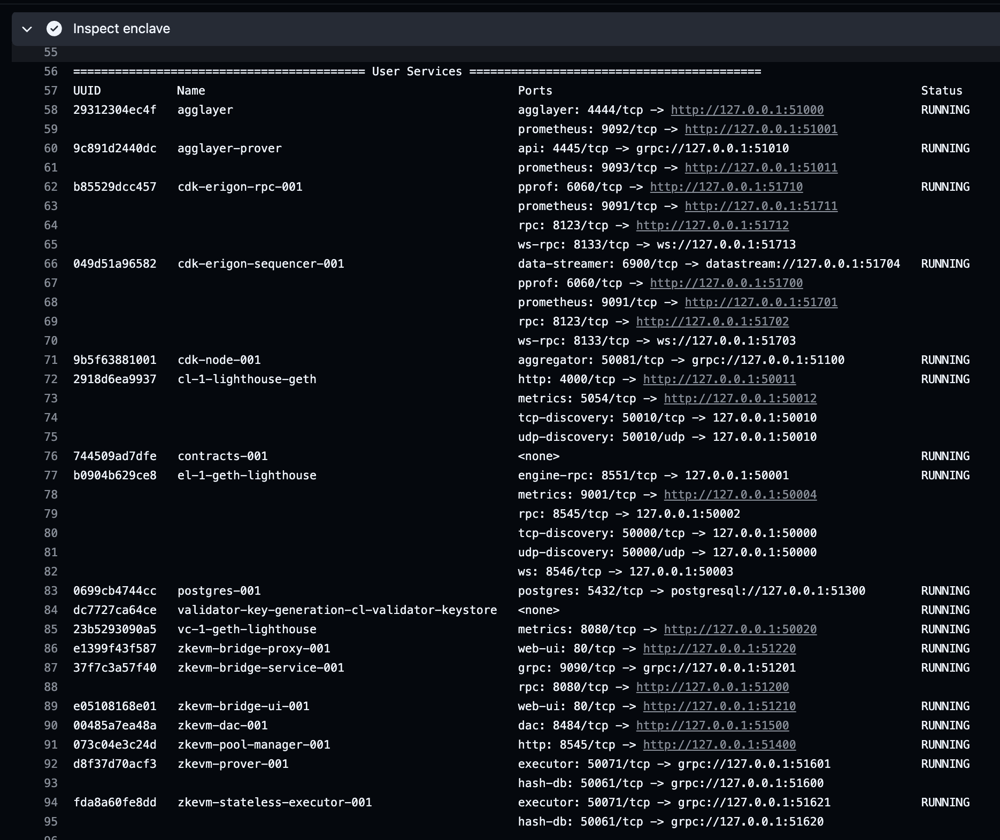
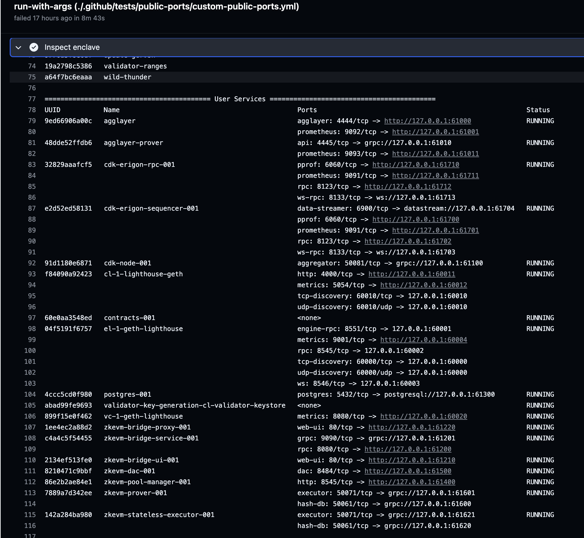
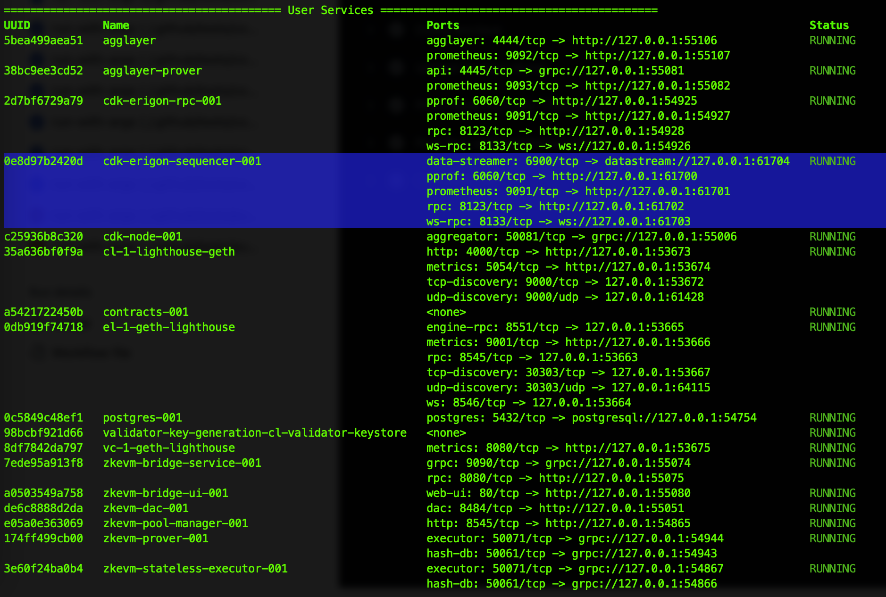

# Public Ports

The goal of this feature is to make it easier to work with the Kurtosis CDK stack. This eliminates the need for developers to create additional scripts to fetch the ports of various services and modify their configurations.

Indeed, Kurtosis binds the ports of enclave services to [ephemeral ports](https://unix.stackexchange.com/questions/65475/ephemeral-port-what-is-it-and-what-does-it-do) on the host machine. To quote the Kurtosis [documentation](https://docs.kurtosis.com/advanced-concepts/public-and-private-ips-and-ports/#public-ips--ports), "these ephemeral ports are called the "public ports" of the container because they allow the container to be accessed outside the Docker/Kubernetes cluster".

To view the private and public port bindings of each container, one can run `kurtosis enclave inspect <enclave-name>` and look for the bindings in the "Ports" column. It is also possible to get the public port binding of a specific service port using `kurtosis port print <enclave-name> <service-name> <port-name>`. For example, `kurtosis port print cdk cdk-erigon-rpc-001 rpc` will print the `rpc` port of the cdk-erigon rpc.

## How does it work?

Each service is assigned a "start port" that indicates the port number where it will begin exposing public ports. For example, if our service `xyz` has its start port set to 1000 and it exposes three ports, the first port a will be available at 1000, the second port b will be at 1001, and the third port c will be at 1002.

By default, the package will expose ports dynamically using Kurtosis, as it has always been the case.

Let's take a look at the different configurations.

### 1. Use the default public ports

We define default public ports in `input_parser.star`.

L1 services will be exposed on the range 50000-50999 and L2 services on the range 51000-51999.

```yml
# cat ./.github/tests/public-ports/default-public-ports.yml
# Use the default public ports defined by the package.
# - L1 services will be exposed on the range 50000-50999.
# - L2 services on the range 51000-51999.
args:
  use_default_public_ports: true
```

You can deploy the stack using:

```bash
kurtosis run --enclave cdk --args-file ./.github/tests/public-ports/default-public-ports.yml .
```

You would get the following result:



This is quite useful for testing. For example, now we know that the cdk-erigon sequencer will always be exposed on port 51704, unless the port config changes.

### 2. Define custom public ports

You can also override the default public ports and define custom public ports.

Here is an example where all the services are assigned to public ports.

> Note that you can also define custom public ports for a subset of services. The other services ports will be assigned dynamically by Kurtosis. 

```yaml
# cat ./.github/tests/public-ports/custom-public-ports.yml
# Override all the default public ports with custom public ports.
# - L1 services will be exposed on the range 60000-60999.
# - L2 services on the range 61000-61999.
args:
  public_ports:
    # L1 public ports (60000-60999).
    l1_el_start_port: 60000
    l1_cl_start_port: 60010
    l1_vc_start_port: 60020
    l1_additional_services_start_port: 60100

    # L2/CDK public ports (61000-61999).
    ## Agglayer
    agglayer_start_port: 61000
    agglayer_prover_start_port: 61010

    ## CDK node
    cdk_node_start_port: 61100

    ## Bridge services
    zkevm_bridge_service_start_port: 61200
    zkevm_bridge_ui_start_port: 61210
    reverse_proxy_start_port: 61220

    ## Databases
    database_start_port: 61300
    pless_database_start_port: 61310

    ## Pool manager
    zkevm_pool_manager_start_port: 61400

    ## DAC
    zkevm_dac_start_port: 61500

    ## ZkEVM Provers
    zkevm_prover_start_port: 61600
    zkevm_executor_start_port: 61610
    zkevm_stateless_executor_start_port: 61620

    ## CDK Erigon
    cdk_erigon_sequencer_start_port: 61700
    cdk_erigon_rpc_start_port: 61710

    # L2 additional services (62000-62999).
    arpeggio_start_port: 62000
    blutgang_start_port: 62010
    erpc_start_port: 62020
    panoptichain_start_port: 62030
```

You can deploy the stack using:

```bash
kurtosis run --enclave cdk --args-file ./.github/tests/public-ports/custom-public-ports.yml .
```

You would get the following result:



Finally, here's another scenario in which only the public port of the cdk-erigon sequencer is specified.

```yaml
# cat ./.github/tests/public-ports/custom-public-ports.yml
# Only expose the datastream port of the cdk-erigon sequencer to a public port.
# All the other ports will be allocated dynamically using Kurtosis.
args:
  public_ports:
    cdk_erigon_sequencer_start_port: 61700
```

Here is how to deploy the stack:

```bash
kurtosis run --enclave cdk --args-file ./.github/tests/public-ports/custom-public-ports-cdk-erigon-sequencer-ds.yml .
```

Here is the result:



As you can see, most of the services are assigned dynamic ports except the cdk-erigon sequencer. For example, the cdk-erigon sequencer datastream port is exposed on port 61704.
