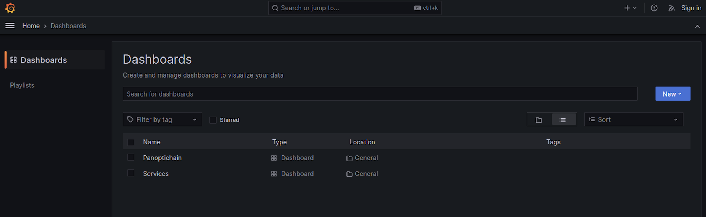
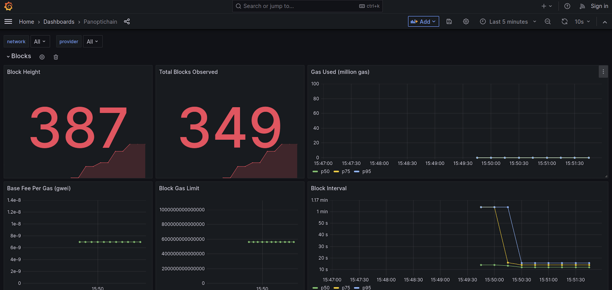
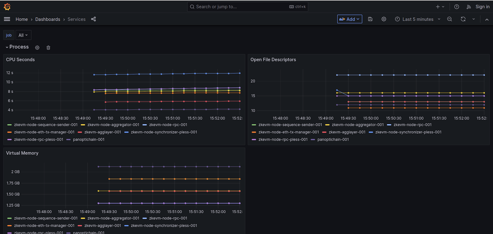

The `kurtosis-cdk` stack deploys Prometheus, Grafana, and Panoptichain to help observe the network. These are enabled by default, but can be turned off by setting the `deploy_observability` to false in the `params.yml`.

Find the dashboard details by running: `kurtosis enclave inspect cdk-v1`

You will see something like this:

```sh
66a0a1fbb82f   grafana-001        dashboards: 3000/tcp -> http://127.0.0.1:49701            RUNNING
3048924295f9   panoptichain-001   prometheus: 9090/tcp -> http://127.0.0.1:49651            RUNNING
df5a52b990f2   prometheus-001     http: 9090/tcp -> http://127.0.0.1:49678                  RUNNING
```

## View dashboards

To view the dashboards, go to the Grafana endpoint with the `/dashboards` path. 

Click the hamburger menu in the top left to go to **Dashboards**. 



There are two predefined dashboards here to help you understand the health of the CDK at a glance.

## Panoptichain

The Panoptichain dashboard displays the metrics that are collected from the Panoptichain service. This dashboard focuses on on-chain metrics such as blocks, transactions, and smart contract calls.



## Services

The services dashboard captures the metrics being emitted by the individual services in the CDK, and metrics pertaining to process health.



## Prometheus targets

To ensure that a service is properly emitting metrics, you can view all the Prometheus targets and their state by navigating to the Prometheus endpoint with the `/targets` path.


</br>